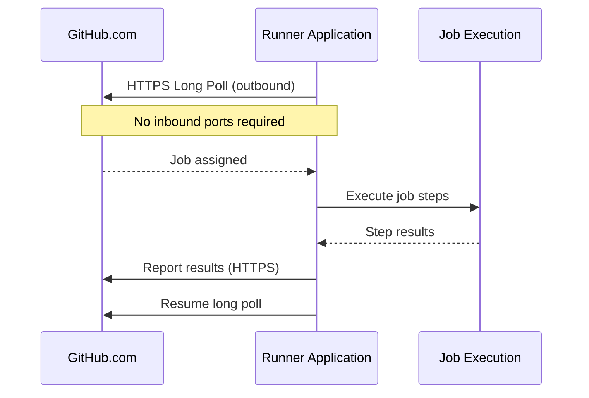
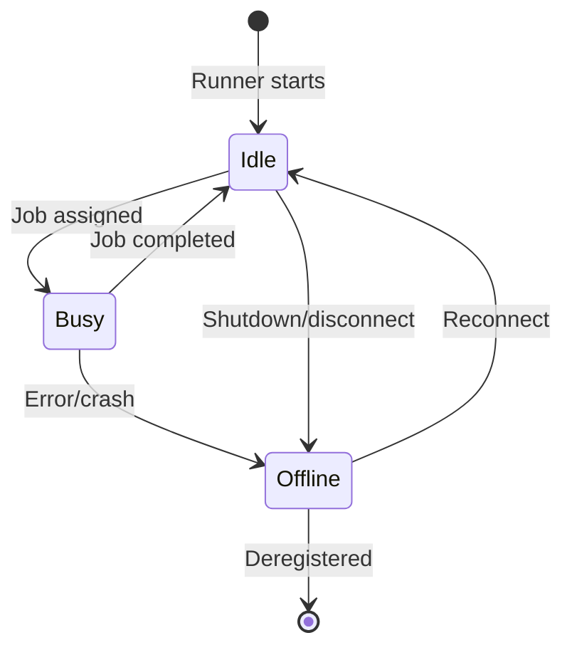

# Introduction to Self-Hosted Runners

This guide introduces the foundational concepts behind CI/CD, GitHub Actions, and self-hosted runners. By the end, you will understand *why* self-hosted runners exist, *how* they work internally, and *when* to choose them over GitHub-hosted runners.

---

## What is CI/CD?

**Continuous Integration (CI)** is the practice of automatically building and testing your code every time someone pushes a change. Instead of waiting for a human to run tests manually, a CI system picks up each commit, compiles the code, executes the test suite, and reports the results—all within minutes. This tight feedback loop catches bugs early, while the context is still fresh in the developer's mind.

**Continuous Delivery (CD)** extends CI by automatically preparing tested code for release. Continuous *Deployment* goes one step further and pushes every successful build straight to production without manual intervention. Together, CI and CD form a pipeline that takes code from a developer's workstation to a running environment with minimal human involvement.

Why does CI/CD matter? Teams that adopt CI/CD ship faster, discover regressions sooner, and produce more reliable releases. Automated pipelines remove the "it works on my machine" problem by building in a consistent, reproducible environment every single time.

> 📖 **Learn more:** [GitHub Actions documentation](https://docs.github.com/en/actions) provides a comprehensive deep-dive into GitHub's native CI/CD platform.

---

## GitHub Actions Overview

GitHub Actions is GitHub's built-in CI/CD platform. It lets you automate workflows directly from your repository using YAML configuration files stored in `.github/workflows/`.

### Core Concepts

| Concept      | Description |
|:-------------|:------------|
| **Workflow** | An automated process defined in a YAML file. Triggered by events, schedules, or manual dispatch. |
| **Job**      | A set of steps that execute on the same runner. Jobs within a workflow run in parallel by default. |
| **Step**     | An individual task inside a job—either a shell command or a reusable action. |
| **Action**   | A reusable, shareable unit of work (e.g., `actions/checkout@v4`). |

### Event Triggers

Workflows start in response to *events*. Common triggers include:

```yaml
on:
  push:                        # Every push to specified branches
    branches: [main]
  pull_request:                # When a PR is opened, synchronized, or reopened
  workflow_dispatch:           # Manual trigger from the GitHub UI or API
  schedule:                    # Cron-based schedule
    - cron: '0 3 * * 1'       # Every Monday at 03:00 UTC
```

### The Role of Runners

Every job in a workflow needs a **runner**—a server that executes the job's steps. When a workflow is triggered, GitHub assigns each job to an available runner based on the `runs-on` label in the workflow file. The runner downloads the code, runs each step, and reports results back to GitHub.

---

## Runners — GitHub-Hosted vs Self-Hosted

GitHub offers two types of runners. Choosing the right one depends on your workload, security requirements, and budget.

| Aspect | GitHub-Hosted | Self-Hosted |
|:-------|:------------:|:-----------:|
| **Managed by** | GitHub | You |
| **Cost** | Included minutes + overage | Your infrastructure cost |
| **Environment** | Fresh VM per job | Persistent or ephemeral |
| **Customization** | Limited (pre-installed tools) | Full control |
| **Hardware** | Standard sizes | Any hardware you want |
| **Network access** | Public internet only | Private network access |
| **OS options** | Ubuntu, Windows, macOS | Any OS you can run the agent on |
| **Maintenance** | Zero | You handle updates & patching |
| **IP addresses** | Dynamic (GitHub range) | Static (your IPs) |
| **Max job time** | 6 hours (cloud) | Configurable |

GitHub-hosted runners are the easiest way to get started—zero setup, always up-to-date, and perfect for open-source or small-team workflows. Self-hosted runners unlock advanced scenarios that GitHub-hosted runners simply cannot address.

---

## Why Self-Hosted Runners?

There are five key reasons teams invest in self-hosted runners:

### 1. Cost Optimization

For high-volume CI/CD, self-hosted runners can be *significantly* cheaper. GitHub-hosted Linux runners cost approximately **$0.008 per minute**. A team burning 10,000 minutes per month pays **$80/month** on GitHub—but a single `Standard_D2s_v3` Azure VM (2 vCPU, 8 GB RAM) costs roughly **$70/month** and can handle far more than 10,000 minutes of workload because it runs continuously. At scale, the savings multiply.

### 2. Custom Hardware and Software

Some workloads demand hardware that GitHub-hosted runners do not offer. Machine-learning training and inference require **GPUs**. Large monorepo builds may need **64+ GB of RAM**. Certain projects depend on **proprietary tools** or **specific OS versions** that are not part of the GitHub-hosted runner image. Self-hosted runners give you full control over the machine specification.

### 3. Private Network Access

Runners deployed inside your **Azure Virtual Network (VNet)** can reach private databases, internal APIs, container registries, and other services that are not exposed to the public internet. This eliminates the need for risky workarounds like SSH tunnels, IP allow-listing, or publicly exposing internal endpoints.

### 4. Compliance Requirements

Regulated industries (finance, healthcare, government) often mandate **data residency**—code must be built and tested within a specific geographic region. Audit requirements may demand full control over the build environment, including the ability to log every command that executes. Self-hosted runners let you satisfy these requirements because *you* own the infrastructure.

### 5. Performance

Self-hosted runners can outperform GitHub-hosted runners in several ways:

- **Larger VMs** with more CPU cores and memory for faster builds.
- **Persistent caches** for package managers (npm, Maven, pip) that survive between jobs.
- **Local artifact storage** that avoids slow uploads and downloads.
- **Reduced startup time** because the runner is already warm and waiting.

---

## Self-Hosted Runner Architecture

The self-hosted runner application is a cross-platform **.NET** agent that communicates with GitHub over **HTTPS on port 443**. Understanding its architecture is essential for secure deployment.



### Key Architectural Points

- **Outbound-only communication** — The runner initiates *all* connections to GitHub. Traffic flows outbound over HTTPS (port 443). GitHub never initiates a connection to the runner.
- **No inbound ports required** — You do not need to open any firewall ports for incoming traffic from GitHub. This dramatically simplifies network security.
- **Long-poll mechanism** — The runner maintains a persistent outbound HTTPS connection to GitHub's service. When a job is queued and the runner matches the required labels, GitHub responds on this open connection with the job payload.
- **Runner application** — The runner itself is a lightweight .NET application (`run.sh` / `run.cmd`) that manages authentication, job dispatch, and result reporting.
- **Worker process** — Each job spawns an isolated worker process. The worker sets up the job environment, checks out code, executes steps, and streams logs back through the runner application.

---

## Runner Lifecycle

A self-hosted runner transitions between three states throughout its life:



### State Descriptions

| State | GitHub UI Color | Description |
|:------|:---------------:|:------------|
| **Idle** | 🟢 Green | The runner is connected to GitHub and waiting for a job. It is healthy and ready to accept work. |
| **Busy** | 🟠 Orange | The runner is currently executing a job. It will not accept new work until the current job finishes. |
| **Offline** | ⚫ Gray | The runner is not connected to GitHub. This can happen due to a graceful shutdown, a network disruption, or a crash. An offline runner is automatically removed from the job-assignment pool. |

When a runner goes offline, it attempts to reconnect automatically. If the runner is deregistered (via `config.sh remove` or the GitHub UI), it is permanently removed and transitions to a terminal state.

---

## Labels and Targeting

Labels control *which* runner picks up *which* job. Every self-hosted runner starts with a set of default labels and can be extended with custom labels.

### Default Labels

Every self-hosted runner is automatically assigned three labels during registration:

| Label | Example | Description |
|:------|:--------|:------------|
| `self-hosted` | `self-hosted` | Identifies the runner as self-hosted (vs GitHub-hosted). |
| OS label | `linux`, `windows`, `macos` | Matches the runner's operating system. |
| Architecture label | `x64`, `arm64` | Matches the runner's CPU architecture. |

### Custom Labels

During configuration (or via the GitHub UI after registration), you can add custom labels to group and target runners:

```bash
./config.sh --labels azure,gpu,production
```

### How `runs-on` Matching Works

The `runs-on` key in a workflow file specifies a list of labels. **A runner must have ALL listed labels** to be eligible for the job:

```yaml
jobs:
  build:
    # Matches any runner that has ALL three labels
    runs-on: [self-hosted, linux, azure]
    steps:
      - uses: actions/checkout@v4
      - run: echo "Running on an Azure-hosted Linux self-hosted runner"
```

### Label Strategy Recommendations

- Use **environment labels** like `production`, `staging`, or `dev` to isolate workloads.
- Use **capability labels** like `gpu`, `high-memory`, or `docker` to match jobs to hardware features.
- Use **cloud labels** like `azure`, `aws`, or `on-prem` to identify where runners are deployed.
- Keep label names **lowercase and hyphenated** for consistency (e.g., `high-memory`, not `HighMemory`).

---

## Ephemeral vs Persistent Runners

Self-hosted runners can operate in two modes, each with distinct trade-offs:

| Aspect | Persistent | Ephemeral |
|:-------|:-----------|:----------|
| **Lifecycle** | Long-running, handles many jobs | Created per job, destroyed after |
| **State** | Accumulates state between jobs | Clean environment every time |
| **Security** | Risk of cross-job contamination | Strong isolation |
| **Performance** | Faster (cached dependencies) | Slower (cold start) |
| **Maintenance** | Needs patching and cleanup | Replaced, not maintained |
| **Best for** | Small teams, trusted repos | Enterprise, public repos, compliance |

### The `--ephemeral` Flag

When you configure a runner with the `--ephemeral` flag, it accepts **exactly one job** and then automatically de-registers itself:

```bash
./config.sh --url https://github.com/ORG/REPO \
            --token XXXXXX \
            --ephemeral
```

After the single job completes, the runner process exits. An external orchestrator (such as a Kubernetes controller, an Azure Container Instance, or a VM Scale Set) is then responsible for spinning up a fresh runner to take its place. This pattern guarantees a clean environment for every job, eliminates cross-job contamination, and simplifies security auditing.

> 💡 **Tip:** Ephemeral runners are the foundation of the **Actions Runner Controller (ARC)** for Kubernetes, which we will explore later in this tutorial series.

---

**Next:** [Decision Guide — VM vs ACI vs AKS](02-decision-guide.md) →
