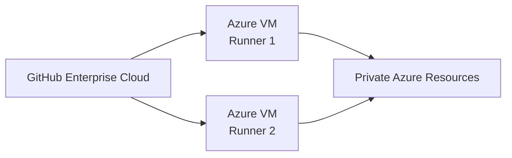
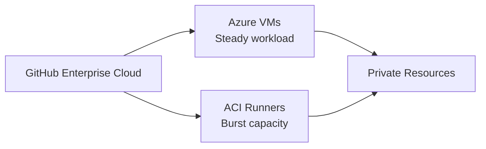
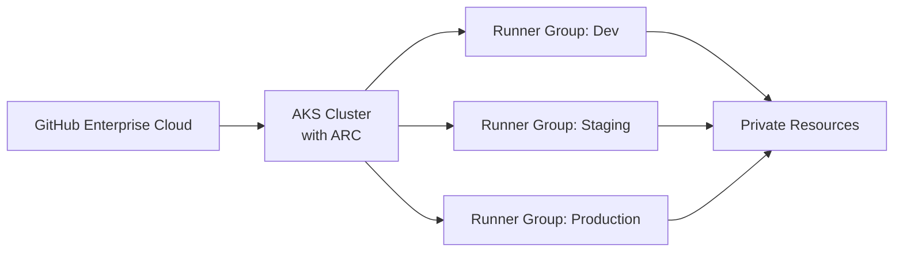
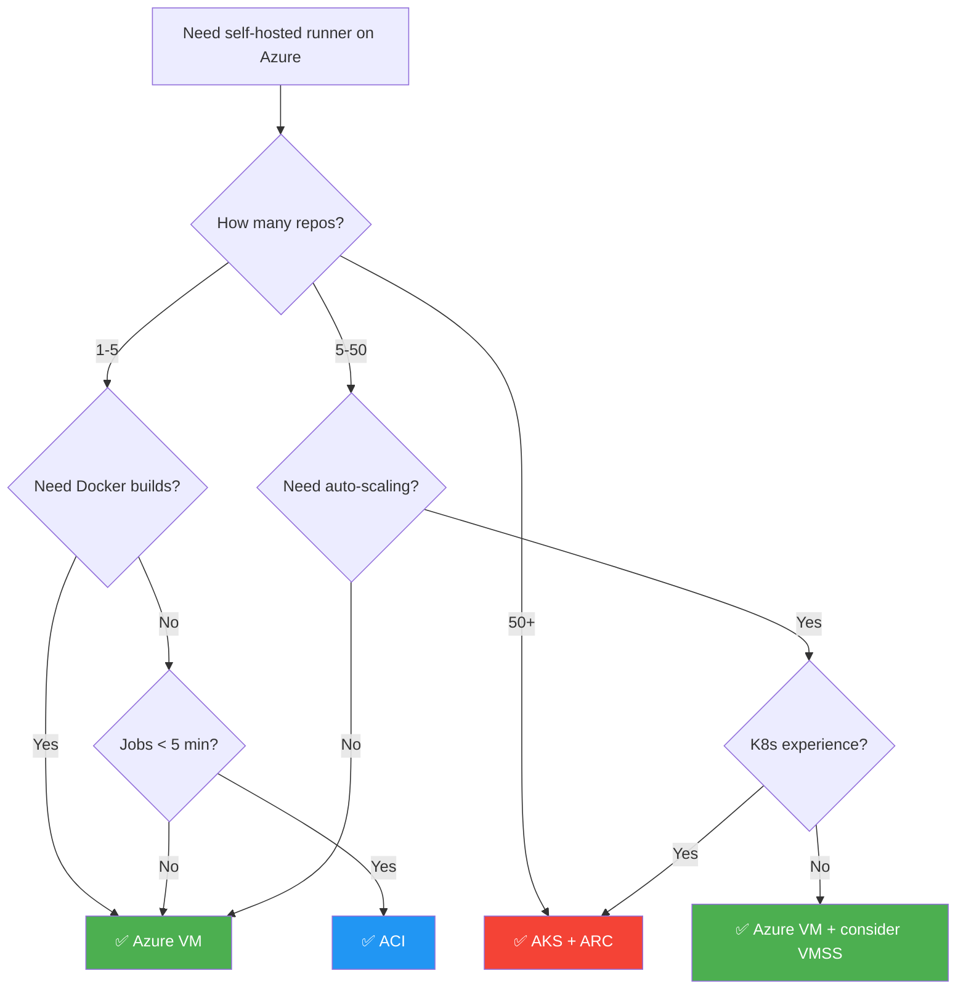

# Decision Guide — VM vs ACI vs AKS

This tutorial covers three Azure platforms for hosting self-hosted runners. This guide helps you choose the right one for your team and workload.

## Platform Decision Matrix

| Criterion | Azure VM | Azure Container Instances | AKS + ARC |
|-----------|----------|--------------------------|-----------|
| **Setup complexity** | 🟢 Low | 🟡 Medium | 🔴 High |
| **Setup time** | ~30 min | ~45 min | ~90 min |
| **Auto-scaling** | ❌ Manual (or VMSS) | Limited (restart) | ✅ Native (ARC) |
| **Ephemeral support** | Via cloud-init script | ✅ Native | ✅ Native |
| **Docker-in-Docker** | ✅ Full support | ❌ Not supported | ✅ DinD sidecar |
| **Service containers** | ✅ Full support | ❌ Not supported | ✅ Full support |
| **Persistent caching** | ✅ Local disk | ❌ No persistent storage | ✅ PVC / Azure Files |
| **Custom tools** | ✅ Install anything | Image only | Image only |
| **GPU workloads** | ✅ GPU VM sizes | ✅ GPU SKUs | ✅ GPU node pools |
| **Private networking** | ✅ VNet native | ✅ VNet injection | ✅ VNet integration |
| **Max concurrent jobs** | 1 per VM | 1 per container | Many per cluster |
| **Cost model** | VM uptime (per hour) | Per second (CPU+memory) | Node pool uptime |
| **Startup time** | Minutes (VM boot) | Seconds (container) | Seconds (pod) |
| **OS patching** | Manual / auto-update | Rebuild image | Node image upgrade |
| **Maintenance burden** | 🟡 Medium | 🟢 Low | 🔴 High |
| **Learning curve** | 🟢 Low | 🟢 Low | 🔴 High (K8s + ARC) |
| **Best for** | General CI/CD, small teams | Simple/short jobs, burst | Enterprise, large scale |

## Reference Architectures

### Small Team (1–5 repositories)

- **Recommendation**: 1-2 Azure VMs
- **Why**: Simple to set up and manage, sufficient capacity, low overhead
- **Estimated cost**: ~$30-60/month (B2s VMs)

### Medium Team (5–50 repositories)

- **Recommendation**: Azure VMs for steady workload + ACI for burst
- **Why**: VMs handle daily CI/CD, ACI provides elastic capacity for peak times
- **Estimated cost**: ~$100-300/month

### Enterprise (50+ repositories)

- **Recommendation**: AKS with Actions Runner Controller
- **Why**: Native auto-scaling, runner groups, ephemeral by default, enterprise governance
- **Estimated cost**: ~$500-2000+/month (depends on cluster size)

## Cost Estimation

### Azure VM Costs (East US, Linux)

| VM Size | vCPU | RAM | Monthly Cost* | Recommended For |
|---------|------|-----|:------------:|-----------------|
| Standard_B1s | 1 | 1 GB | ~$7 | Testing only |
| Standard_B2s | 2 | 4 GB | ~$30 | Light CI/CD |
| Standard_B2ms | 2 | 8 GB | ~$60 | General CI/CD |
| Standard_D2s_v5 | 2 | 8 GB | ~$70 | Production |
| Standard_D4s_v5 | 4 | 16 GB | ~$140 | Heavy builds |
| Standard_D8s_v5 | 8 | 32 GB | ~$280 | Large monorepos |

*Approximate pay-as-you-go prices. Reserved instances save 30-60%.

### ACI Costs

- ~$0.0025/second per vCPU, ~$0.0000125/second per GB RAM
- Example: 2 vCPU, 4 GB job running 5 min = ~$0.78 per job
- Best when total job time is low (< few hours/day)

### AKS Costs

- Node pool VMs + AKS management (free tier available)
- Example: 3-node D2s_v5 cluster = ~$210/month
- Most cost-effective at scale with cluster autoscaler

## Platform Constraints & Limitations

### Azure VM Limitations

> [!NOTE]
> Azure VMs are the most flexible option but require the most manual maintenance.

- Single job at a time per runner (unless running multiple runner instances)
- Manual scaling (unless combined with VMSS)
- OS patching is your responsibility
- VM reboot required for kernel updates

### ACI Limitations

> [!WARNING]
> ACI has significant constraints that make it unsuitable for many CI/CD workloads.

- **No Docker-in-Docker**: Cannot build Docker images inside the container
- **No service containers**: GitHub Actions service containers are not supported
- **No persistent storage**: Each container starts fresh (no caching between jobs)
- **Limited CPU/memory**: Max 4 vCPU, 16 GB per container group
- **No privileged mode**: Cannot run privileged containers
- **Restart behavior**: Limited control over restart policies
- **Best for**: Linting, testing, simple builds, notifications, deployments

### AKS + ARC Limitations

> [!NOTE]
> AKS + ARC is the most powerful but also the most complex option.

- Requires Kubernetes expertise
- ARC has its own release cycle (CRD upgrades needed)
- Cluster management overhead (upgrades, monitoring, security)
- Higher minimum cost (at least 1-2 always-on nodes)
- Docker-in-Docker requires privileged pods or kaniko alternative

## Decision Flowchart

---

← **Previous:** [Introduction](01-introduction.md) | **Next:** [Prerequisites](03-prerequisites.md) →
