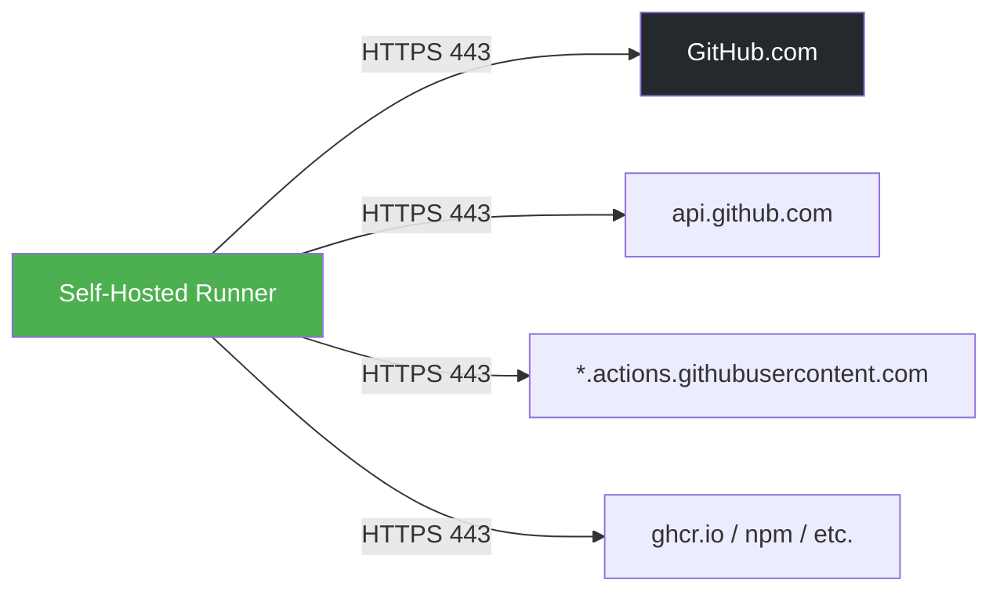
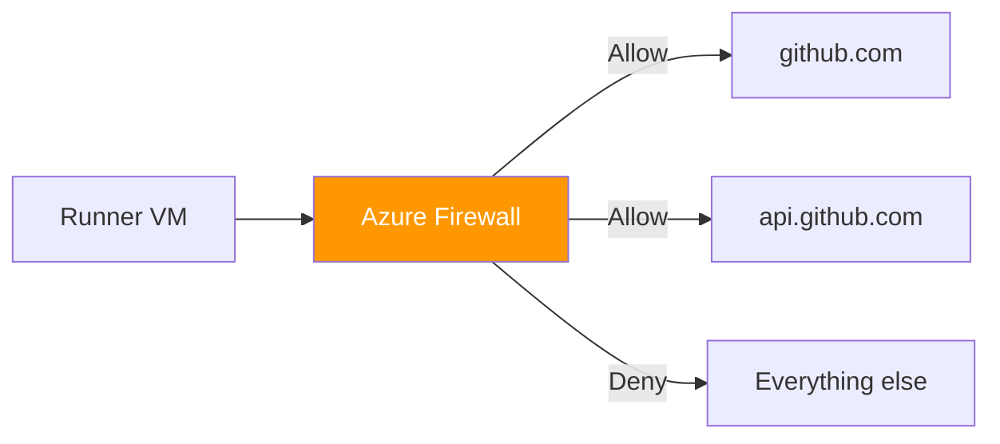
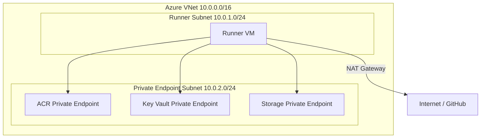

# Networking and Connectivity

Networking is one of the top real-world failure modes for self-hosted runners. Misconfigured firewalls, missing DNS entries, or blocked outbound ports can prevent runners from registering, picking up jobs, or downloading actions. This guide covers all the network requirements, security configurations, and troubleshooting techniques you need to ensure reliable runner connectivity.

## How Runner Communication Works

Understanding the communication model is essential before configuring any network rules.



Key points about the runner communication model:

- **Outbound-only** — The runner initiates ALL connections to GitHub. No inbound ports are required. GitHub never connects *to* your runner.
- **HTTPS (port 443)** — All communication uses TLS-encrypted HTTPS. No custom ports or protocols are needed.
- **Long-poll** — The runner maintains a persistent outbound connection to GitHub, waiting for job assignments. If this connection drops, the runner automatically reconnects.
- **Heartbeat** — The runner sends periodic heartbeats to GitHub to signal that it is online and ready. If heartbeats stop arriving, GitHub marks the runner as offline.

## Required Outbound Endpoints

The runner must be able to reach the following endpoints. Blocking any **required** endpoint will cause registration or job execution failures.

| Endpoint | Port | Protocol | Purpose | Required? |
|----------|------|----------|---------|:---------:|
| `github.com` | 443 | HTTPS | Web UI, Git operations | ✅ |
| `api.github.com` | 443 | HTTPS | REST API, runner registration | ✅ |
| `*.actions.githubusercontent.com` | 443 | HTTPS | Action downloads, caches | ✅ |
| `codeload.github.com` | 443 | HTTPS | Code archive downloads | ✅ |
| `results-receiver.actions.githubusercontent.com` | 443 | HTTPS | Workflow run results | ✅ |
| `pipelines.actions.githubusercontent.com` | 443 | HTTPS | Workflow telemetry | ✅ |
| `*.pkg.github.com` | 443 | HTTPS | GitHub Packages | If using Packages |
| `ghcr.io` | 443 | HTTPS | GitHub Container Registry | If using GHCR |
| `*.blob.core.windows.net` | 443 | HTTPS | Actions cache (Azure Blob) | If using caching |
| `token.actions.githubusercontent.com` | 443 | HTTPS | OIDC token endpoint | If using OIDC |
| `login.microsoftonline.com` | 443 | HTTPS | Azure AD authentication | If using OIDC |
| `management.azure.com` | 443 | HTTPS | Azure Resource Manager | If deploying to Azure |
| `*.azurecr.io` | 443 | HTTPS | Azure Container Registry | If using ACR |
| `vault.azure.net` | 443 | HTTPS | Azure Key Vault | If using Key Vault |
| `packages.microsoft.com` | 443 | HTTPS | Microsoft packages | For apt updates |
| `azure.archive.ubuntu.com` | 80/443 | HTTP/S | Ubuntu packages | For apt updates |

> [!TIP]
> For the most current list of GitHub Actions IP ranges, query the GitHub API:
> ```bash
> curl -s https://api.github.com/meta | jq '.actions'
> ```

## Network Security Group (NSG) Rules

Azure NSGs act as a virtual firewall for your runner VM's network interface or subnet.

### Recommended Inbound Rules

| Priority | Name | Port | Source | Action | Notes |
|----------|------|------|--------|--------|-------|
| 100 | AllowSSH | 22 | Your IP | Allow | Management access |
| 4096 | DenyAllInbound | * | * | Deny | Block everything else |

> [!WARNING]
> Never expose SSH to the internet (`0.0.0.0/0`). Always restrict to a specific IP address or use Azure Bastion for secure, browser-based access.

### Recommended Outbound Rules

| Priority | Name | Port | Destination | Action |
|----------|------|------|-------------|--------|
| 100 | AllowHTTPS | 443 | Internet | Allow |
| 110 | AllowHTTP | 80 | Internet | Allow |
| 4096 | DenyAll | * | * | Deny |

### Azure CLI Commands to Create NSG

```bash
# Create NSG
az network nsg create \
  --resource-group ghrunner-rg \
  --name ghrunner-nsg

# Allow SSH from your IP only
az network nsg rule create \
  --resource-group ghrunner-rg \
  --nsg-name ghrunner-nsg \
  --name AllowSSH \
  --priority 100 \
  --direction Inbound \
  --access Allow \
  --protocol Tcp \
  --destination-port-ranges 22 \
  --source-address-prefixes "$(curl -s ifconfig.me)/32"

# Allow outbound HTTPS
az network nsg rule create \
  --resource-group ghrunner-rg \
  --nsg-name ghrunner-nsg \
  --name AllowHTTPS \
  --priority 100 \
  --direction Outbound \
  --access Allow \
  --protocol Tcp \
  --destination-port-ranges 443 \
  --destination-address-prefixes Internet
```

## Azure Firewall for Egress Control

When you need more granular outbound control than NSG provides — for example, restricting traffic to specific FQDNs rather than allowing all internet access — use Azure Firewall.



The approach involves three pieces:

1. **Application rules** — Azure Firewall application rules support FQDN-based filtering, so you can allow `github.com` and `*.actions.githubusercontent.com` without opening broad IP ranges.
2. **Rule collection** — Group all required GitHub FQDNs into a single application rule collection for easy management.
3. **Route table (UDR)** — A User-Defined Route forces all traffic from the runner subnet through the firewall before reaching the internet.

```bash
# Create firewall (note: Azure Firewall is expensive for tutorials)
# This is for production reference only

# Application rule for GitHub endpoints
az network firewall application-rule create \
  --resource-group ghrunner-rg \
  --firewall-name ghrunner-fw \
  --collection-name github-rules \
  --name allow-github \
  --protocols Https=443 \
  --target-fqdns "github.com" "*.github.com" "api.github.com" \
    "*.actions.githubusercontent.com" "ghcr.io" "*.ghcr.io" \
    "token.actions.githubusercontent.com" \
  --source-addresses "10.0.1.0/24" \
  --priority 100 \
  --action Allow
```

## Proxy Configuration

If your environment requires an HTTP proxy for outbound access, configure the runner to route traffic through it.

### Setting Proxy Environment Variables

```bash
# Set proxy environment variables for the runner
export HTTP_PROXY=http://proxy.example.com:8080
export HTTPS_PROXY=http://proxy.example.com:8080
export NO_PROXY=localhost,127.0.0.1,169.254.169.254

# Or configure in the runner's .env file (persists across restarts)
echo "HTTP_PROXY=http://proxy.example.com:8080" >> /home/runner/actions-runner/.env
echo "HTTPS_PROXY=http://proxy.example.com:8080" >> /home/runner/actions-runner/.env
echo "NO_PROXY=localhost,127.0.0.1,169.254.169.254" >> /home/runner/actions-runner/.env
```

### TLS Inspection (Corporate Proxies)

Some corporate proxies perform TLS inspection (man-in-the-middle decryption/re-encryption). When this is the case, the runner must trust the proxy's CA certificate:

```bash
# Add the corporate CA certificate to the system trust store
sudo cp corporate-ca.crt /usr/local/share/ca-certificates/
sudo update-ca-certificates

# Also set NODE_EXTRA_CA_CERTS for Node.js-based actions
export NODE_EXTRA_CA_CERTS=/usr/local/share/ca-certificates/corporate-ca.crt
echo "NODE_EXTRA_CA_CERTS=/usr/local/share/ca-certificates/corporate-ca.crt" >> /home/runner/actions-runner/.env
```

> [!NOTE]
> If you skip the CA certificate step, the runner and many actions will fail with `UNABLE_TO_VERIFY_LEAF_SIGNATURE` or similar TLS errors.

## Private Networking

For runners that need to access private Azure resources (databases, storage, key vaults) without exposing those services to the public internet, use Azure private networking.



Key components:

- **Private Endpoints** — Access Azure services (Key Vault, ACR, Storage) over a private IP address within your VNet. Traffic never leaves the Azure backbone.
- **Service Endpoints** — Route traffic to Azure services via the Azure backbone network, keeping it off the public internet while still using public IPs.
- **NAT Gateway** — Provide outbound internet connectivity (for reaching GitHub) with a static public IP, useful for IP allowlisting.

### Example: Create a Private Endpoint for Key Vault

```bash
az network private-endpoint create \
  --resource-group ghrunner-rg \
  --name ghrunner-kv-pe \
  --vnet-name ghrunner-vnet \
  --subnet private-endpoint-subnet \
  --private-connection-resource-id $(az keyvault show -n ghrunner-kv --query id -o tsv) \
  --group-id vault \
  --connection-name kv-connection
```

## DNS Configuration

When using private endpoints, Azure services resolve to private IP addresses. You need private DNS zones so the runner resolves the correct addresses.

```bash
# Create private DNS zone for Key Vault
az network private-dns zone create \
  --resource-group ghrunner-rg \
  --name "privatelink.vaultcore.azure.net"

# Link the DNS zone to your VNet
az network private-dns zone vnet-link create \
  --resource-group ghrunner-rg \
  --zone-name "privatelink.vaultcore.azure.net" \
  --name kv-dns-link \
  --virtual-network ghrunner-vnet \
  --registration-enabled false
```

Common private DNS zones for Azure services:

| Service | Private DNS Zone |
|---------|-----------------|
| Key Vault | `privatelink.vaultcore.azure.net` |
| Container Registry | `privatelink.azurecr.io` |
| Blob Storage | `privatelink.blob.core.windows.net` |
| Azure SQL | `privatelink.database.windows.net` |

## Connectivity Verification Script

Use this script to verify that your runner can reach all required endpoints before registration:

```bash
#!/bin/bash
# connectivity-test.sh — Verify runner can reach all required endpoints

echo "=== GitHub Actions Runner Connectivity Test ==="
echo ""

ENDPOINTS=(
  "https://github.com"
  "https://api.github.com"
  "https://codeload.github.com"
  "https://results-receiver.actions.githubusercontent.com"
  "https://token.actions.githubusercontent.com"
  "https://pipelines.actions.githubusercontent.com"
  "https://ghcr.io"
  "https://login.microsoftonline.com"
  "https://management.azure.com"
)

PASS=0
FAIL=0

for endpoint in "${ENDPOINTS[@]}"; do
  status=$(curl -sS -o /dev/null -w "%{http_code}" --max-time 10 "$endpoint" 2>/dev/null)
  if [[ "$status" =~ ^[23] ]]; then
    echo "✅ $endpoint (HTTP $status)"
    ((PASS++))
  else
    echo "❌ $endpoint (HTTP $status)"
    ((FAIL++))
  fi
done

echo ""
echo "Results: $PASS passed, $FAIL failed"
if [ $FAIL -gt 0 ]; then
  echo "⚠️  Some endpoints are unreachable. Check NSG/firewall rules."
  exit 1
fi
echo "✅ All endpoints reachable!"
```

Save this script and run it on your runner VM:

```bash
chmod +x connectivity-test.sh
./connectivity-test.sh
```

---

← **Previous:** [Prerequisites](03-prerequisites.md) | **Next:** [GitHub Auth & Tokens](05-github-auth-tokens.md) →
