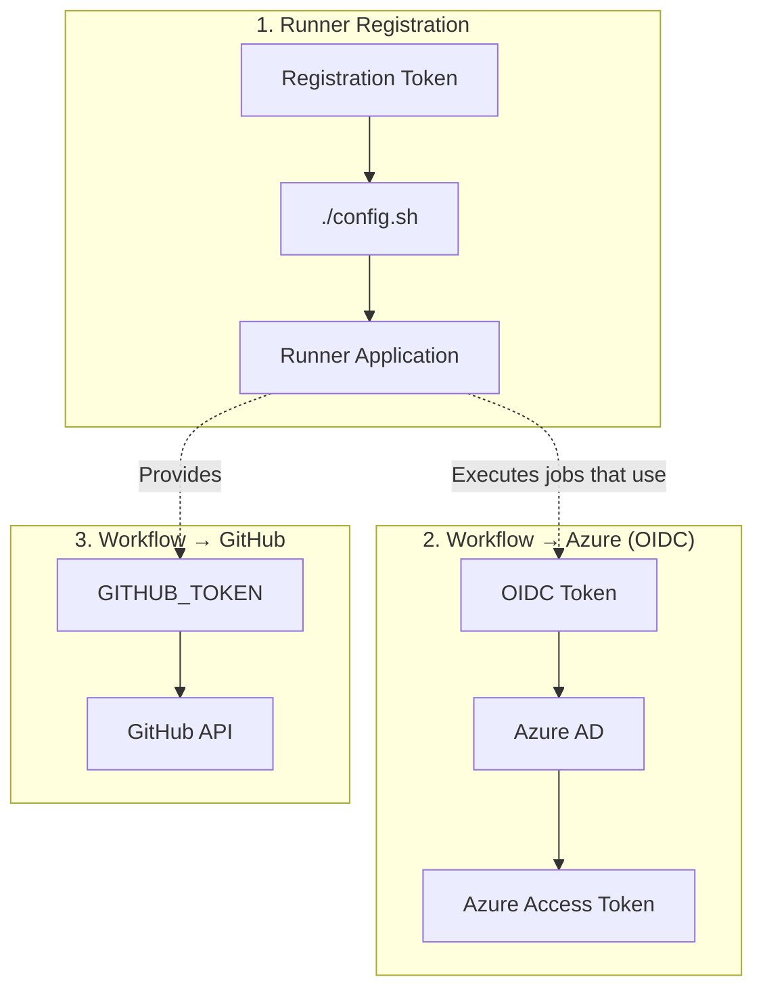

# GitHub Authentication and Tokens

There are **three distinct authentication flows** involved in self-hosted runners, and confusing them is a common source of errors:

1. **Runner Registration Auth** — How the runner registers with GitHub
2. **Workflow-to-Cloud Auth** — How workflows authenticate to Azure (covered in doc 10)
3. **Workflow-to-GitHub Auth** — The automatic GITHUB_TOKEN within workflows



> [!IMPORTANT]
> This guide covers **Flow 1 (Runner Registration)**. For Flow 2 (OIDC), see [OIDC & Workload Identity](10-oidc-workload-identity.md). Flow 3 (GITHUB_TOKEN) is automatic.

## 1. Runner Registration Token

A runner registration token is:

- A **short-lived token** (expires in 1 hour) used ONLY during `./config.sh`
- Scoped to a specific repository or organization
- **Not stored** after registration — the runner uses a different credential for ongoing communication

### Method A: GitHub UI

**Repository-level:**

1. Navigate to your repository → **Settings**
2. Left sidebar → **Actions** → **Runners**
3. Click **New self-hosted runner**
4. Select **Linux** and **x64**
5. Copy the token from the `./config.sh` command shown
6. Token is valid for 1 hour

**Organization-level:**

1. Navigate to your organization → **Settings**
2. Left sidebar → **Actions** → **Runners**
3. Same process

### Method B: GitHub CLI (`gh`)

```bash
# Repository-level token
gh api repos/OWNER/REPO/actions/runners/registration-token \
  -X POST --jq '.token'

# Organization-level token
gh api orgs/ORG/actions/runners/registration-token \
  -X POST --jq '.token'
```

### Method C: REST API with PAT

```bash
# Repository-level
curl -X POST \
  -H "Authorization: Bearer <PAT>" \
  -H "Accept: application/vnd.github+json" \
  https://api.github.com/repos/OWNER/REPO/actions/runners/registration-token \
  | jq -r '.token'

# Organization-level
curl -X POST \
  -H "Authorization: Bearer <PAT>" \
  -H "Accept: application/vnd.github+json" \
  https://api.github.com/orgs/ORG/actions/runners/registration-token \
  | jq -r '.token'
```

> [!NOTE]
> The registration token expires in **1 hour**. Generate it right before you need it.

## 2. Personal Access Tokens (PATs)

### Classic PAT

- **Create**: Settings → Developer settings → Personal access tokens → Tokens (classic)
- **Required scopes**:

| Scope | Needed for |
|-------|-----------|
| `repo` | Repository-level runner registration |
| `admin:org` | Organization-level runner management |
| `manage_runners:enterprise` | Enterprise-level runner management |

### Fine-Grained PAT (Recommended)

- **Create**: Settings → Developer settings → Personal access tokens → Fine-grained tokens
- **Required permissions**:

| Permission | Access Level | Purpose |
|-----------|-------------|---------|
| Administration | Read & Write | Runner management |
| Metadata | Read-only | Repository access |

- Scope to specific repositories for better security

### Security Best Practices for PATs

> [!WARNING]
> PATs are long-lived credentials. Handle with care.

- Set the shortest practical expiration (30-90 days)
- Use fine-grained PATs scoped to specific repos when possible
- Store PATs in Azure Key Vault, not in scripts
- Rotate regularly
- Audit PAT usage in GitHub settings
- **Prefer GitHub Apps over PATs for automation** (see next section)

## 3. GitHub App Authentication (Preferred for Automation)

Why GitHub App is better than PAT:

| Aspect | PAT | GitHub App |
|--------|-----|-----------|
| **Tied to** | A person | The organization |
| **Permissions** | Broad scopes | Granular per-endpoint |
| **Rate limits** | User limits (5000/hr) | Higher limits (15000/hr) |
| **Token lifetime** | Long-lived | Short-lived (1 hr) |
| **Audit trail** | Shows as user | Shows as app |
| **Rotation** | Manual | Automatic |
| **Bus factor** | If user leaves, tokens break | Independent of users |

### Step-by-Step: Create a GitHub App

1. **Navigate**: Organization → Settings → Developer settings → GitHub Apps → New GitHub App
2. **Configure**:
   - **Name**: `Self-Hosted Runner Manager` (or similar)
   - **Homepage URL**: Your org URL
   - **Webhook**: Uncheck "Active" (not needed for runner management)
3. **Permissions** — Set these under "Organization permissions":

   | Permission | Access |
   |-----------|--------|
   | Self-hosted runners | Read & Write |
   | Administration (repo) | Read & Write |

4. **Where can this GitHub App be installed?**: "Only on this account"
5. Click **Create GitHub App**
6. **Note the App ID** (shown at top of app settings page)

### Generate Private Key

1. Scroll down to **Private keys**
2. Click **Generate a private key**
3. Save the `.pem` file securely (you'll need it for authentication)

### Install the App

1. Left sidebar → **Install App**
2. Select your organization
3. Choose "All repositories" or select specific ones
4. Click **Install**
5. **Note the Installation ID** from the URL: `https://github.com/organizations/ORG/settings/installations/<INSTALLATION_ID>`

### Generate Installation Access Token

To use the app programmatically, you need to:

1. Create a JWT from the App's private key
2. Exchange the JWT for an installation access token

```bash
#!/bin/bash
# generate-token.sh — Generate GitHub App installation access token

APP_ID="<YOUR_APP_ID>"
INSTALLATION_ID="<YOUR_INSTALLATION_ID>"
PRIVATE_KEY_FILE="path/to/private-key.pem"

# Generate JWT
NOW=$(date +%s)
IAT=$((NOW - 60))
EXP=$((NOW + 600))

HEADER=$(echo -n '{"alg":"RS256","typ":"JWT"}' | base64 -w 0 | tr '+/' '-_' | tr -d '=')
PAYLOAD=$(echo -n "{\"iat\":${IAT},\"exp\":${EXP},\"iss\":\"${APP_ID}\"}" | base64 -w 0 | tr '+/' '-_' | tr -d '=')
SIGNATURE=$(echo -n "${HEADER}.${PAYLOAD}" | openssl dgst -sha256 -sign "${PRIVATE_KEY_FILE}" | base64 -w 0 | tr '+/' '-_' | tr -d '=')

JWT="${HEADER}.${PAYLOAD}.${SIGNATURE}"

# Exchange JWT for installation access token
INSTALLATION_TOKEN=$(curl -s -X POST \
  -H "Authorization: Bearer ${JWT}" \
  -H "Accept: application/vnd.github+json" \
  "https://api.github.com/app/installations/${INSTALLATION_ID}/access_tokens" \
  | jq -r '.token')

echo "${INSTALLATION_TOKEN}"
```

Then use this token to create a registration token:

```bash
INSTALL_TOKEN=$(./generate-token.sh)

RUNNER_TOKEN=$(curl -s -X POST \
  -H "Authorization: Bearer ${INSTALL_TOKEN}" \
  -H "Accept: application/vnd.github+json" \
  "https://api.github.com/orgs/ORG/actions/runners/registration-token" \
  | jq -r '.token')

./config.sh --url https://github.com/ORG --token "${RUNNER_TOKEN}"
```

## 4. Just-In-Time (JIT) Runner Configuration

JIT configuration is an alternative to registration tokens for ephemeral runners. Instead of registering a persistent runner, you get a one-time configuration that automatically deregisters after one job.

```bash
# Generate JIT config via API
JIT_CONFIG=$(curl -s -X POST \
  -H "Authorization: Bearer ${TOKEN}" \
  -H "Accept: application/vnd.github+json" \
  "https://api.github.com/repos/OWNER/REPO/actions/runners/generate-jitconfig" \
  -d '{
    "name": "jit-runner-'$(date +%s)'",
    "runner_group_id": 1,
    "labels": ["self-hosted", "linux", "x64"],
    "work_folder": "_work"
  }' | jq -r '.encoded_jit_config')

# Use JIT config to start runner (no config.sh needed!)
./run.sh --jitconfig "${JIT_CONFIG}"
```

When to use JIT:

- Ephemeral, single-use runners
- Dynamic scaling with VM/container orchestration
- When you want automatic deregistration

## 5. Runner Removal / Deregistration

### Graceful Removal (from the runner machine)

```bash
cd ~/actions-runner
./config.sh remove --token <REMOVE_TOKEN>
```

Get a remove token:

```bash
# Via GitHub CLI
gh api repos/OWNER/REPO/actions/runners/remove-token -X POST --jq '.token'
```

### Force Remove Offline Runners (via API)

```bash
# List runners
RUNNERS=$(gh api repos/OWNER/REPO/actions/runners --jq '.runners[] | select(.status == "offline") | .id')

# Remove each offline runner
for id in $RUNNERS; do
  gh api repos/OWNER/REPO/actions/runners/$id -X DELETE
  echo "Removed runner $id"
done
```

### Cleanup Stale Runners

> [!TIP]
> Runners that have been offline for more than 14 days are automatically removed by GitHub. For faster cleanup, use the API above.

## 6. Token Security Summary

| Token Type | Lifetime | Storage | Rotation |
|-----------|----------|---------|----------|
| Registration Token | 1 hour | Don't store | Generate fresh each time |
| PAT (Classic) | Up to 1 year | Key Vault | Every 30-90 days |
| PAT (Fine-grained) | Up to 1 year | Key Vault | Every 30-90 days |
| GitHub App JWT | 10 minutes | Generated on-demand | Automatic |
| GitHub App Install Token | 1 hour | Don't store | Generate fresh each time |
| JIT Config | Single use | Don't store | Generated per runner |
| GITHUB_TOKEN | Job duration | Automatic | Automatic |
| Remove Token | 1 hour | Don't store | Generate when needed |

---

← **Previous:** [Networking & Connectivity](04-networking-connectivity.md) | **Next:** [VM Manual Setup](06-vm-manual-setup.md) →
