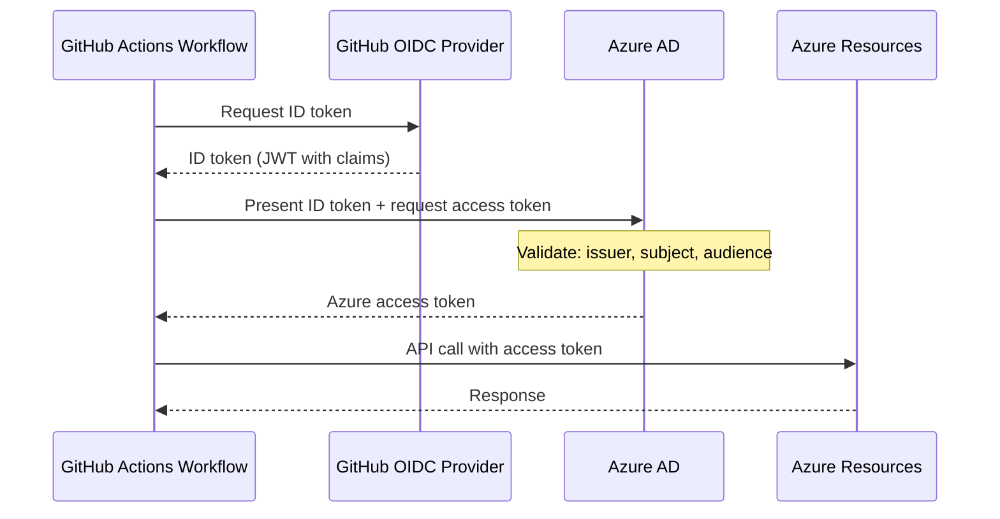

# OIDC and Workload Identity Federation

## Introduction

OIDC (OpenID Connect) workload identity federation allows GitHub Actions workflows to authenticate to Azure **without storing any secrets**. Instead of managing client secrets or certificates that must be rotated, workflows exchange a short-lived GitHub-issued token for an Azure access token — all through a trust relationship configured in Azure AD. This is the modern, recommended approach for GitHub Actions authentication to Azure.

## Why OIDC?

Traditional service principal authentication requires storing a client secret in GitHub Secrets. OIDC federation eliminates this entirely:

- **No stored secrets** — No client secrets or certificates to rotate
- **Short-lived tokens** — Tokens valid for minutes, not months
- **Audit trail** — Every token exchange is logged in Azure AD
- **Reduced blast radius** — A compromised runner can't extract long-lived credentials

| Aspect | Service Principal + Secret | OIDC Federation |
|--------|:-------------------------:|:---------------:|
| Secret storage | GitHub Secrets | None |
| Token lifetime | Months/Years | Minutes |
| Rotation | Manual | Automatic |
| Risk if leaked | Full access until rotated | Already expired |
| Setup complexity | Simple | Medium |
| Audit trail | Limited | Full |

## How It Works



**Step-by-step breakdown:**

1. **Workflow requests an OIDC token** — The workflow calls GitHub's internal token endpoint (`ACTIONS_ID_TOKEN_REQUEST_URL`) to request an ID token.
2. **GitHub issues a JWT** — GitHub's OIDC provider returns a signed JWT containing claims about the workflow run: repository, branch, environment, actor, and more.
3. **Workflow presents the JWT to Azure AD** — The `azure/login` action sends the GitHub JWT to Azure AD's token endpoint, requesting an Azure access token.
4. **Azure AD validates the token** — Azure AD checks the JWT's issuer (`token.actions.githubusercontent.com`), subject claim (repo, branch, environment), and audience against the federated credential configuration.
5. **Azure AD issues an access token** — If validation passes, Azure AD returns a short-lived Azure access token scoped to the configured permissions.
6. **Workflow calls Azure APIs** — The workflow uses the Azure access token to interact with Azure resources (deploy infrastructure, push to ACR, read Key Vault, etc.).

## Azure Setup — Step by Step

### Step 1: Create Azure AD App Registration

```bash
# Create app registration
az ad app create --display-name "GitHub Actions OIDC - Self-Hosted Runners"

# Note the appId (clientId)
APP_ID=$(az ad app list --display-name "GitHub Actions OIDC - Self-Hosted Runners" --query "[0].appId" -o tsv)
echo "App ID: $APP_ID"

# Create service principal
az ad sp create --id $APP_ID

# Get service principal object ID (needed for role assignment)
SP_OBJECT_ID=$(az ad sp show --id $APP_ID --query "id" -o tsv)
echo "SP Object ID: $SP_OBJECT_ID"
```

### Step 2: Configure Federated Credential

The **subject claim** determines which workflows can authenticate. Choose the format that matches your security requirements:

| Scenario | Subject Claim Format |
|----------|---------------------|
| Specific branch | `repo:OWNER/REPO:ref:refs/heads/BRANCH` |
| Any branch | `repo:OWNER/REPO:ref:refs/heads/*` |
| Specific tag | `repo:OWNER/REPO:ref:refs/tags/TAG` |
| Pull requests | `repo:OWNER/REPO:pull_request` |
| Environment | `repo:OWNER/REPO:environment:ENV_NAME` |

```bash
# Create federated credential for main branch
az ad app federated-credential create --id $APP_ID --parameters '{
  "name": "github-actions-main",
  "issuer": "https://token.actions.githubusercontent.com",
  "subject": "repo:YOUR-ORG/YOUR-REPO:ref:refs/heads/main",
  "audiences": ["api://AzureADTokenExchange"],
  "description": "GitHub Actions - main branch"
}'

# Create federated credential for pull requests
az ad app federated-credential create --id $APP_ID --parameters '{
  "name": "github-actions-pr",
  "issuer": "https://token.actions.githubusercontent.com",
  "subject": "repo:YOUR-ORG/YOUR-REPO:pull_request",
  "audiences": ["api://AzureADTokenExchange"],
  "description": "GitHub Actions - pull requests"
}'

# Create federated credential for an environment
az ad app federated-credential create --id $APP_ID --parameters '{
  "name": "github-actions-production",
  "issuer": "https://token.actions.githubusercontent.com",
  "subject": "repo:YOUR-ORG/YOUR-REPO:environment:production",
  "audiences": ["api://AzureADTokenExchange"],
  "description": "GitHub Actions - production environment"
}'
```

### Step 3: Assign Azure Roles

```bash
# Get subscription ID
SUBSCRIPTION_ID=$(az account show --query id -o tsv)

# Assign Contributor role on resource group
az role assignment create \
  --assignee $SP_OBJECT_ID \
  --role "Contributor" \
  --scope "/subscriptions/$SUBSCRIPTION_ID/resourceGroups/ghrunner-rg"

# For more restrictive access, use specific roles:
# az role assignment create --assignee $SP_OBJECT_ID --role "AcrPush" --scope <acr-resource-id>
# az role assignment create --assignee $SP_OBJECT_ID --role "Key Vault Secrets User" --scope <kv-resource-id>
```

### Step 4: Store Configuration in GitHub Secrets

```bash
# Add secrets to repository (or organization)
gh secret set AZURE_CLIENT_ID --body "$APP_ID"
gh secret set AZURE_TENANT_ID --body "$(az account show --query tenantId -o tsv)"
gh secret set AZURE_SUBSCRIPTION_ID --body "$SUBSCRIPTION_ID"
```

> [!IMPORTANT]
> These are NOT credentials — they're identifiers. The actual authentication happens via the OIDC token exchange. No secrets are stored!

## Workflow Configuration

### Basic OIDC Login

```yaml
name: Azure Deployment with OIDC

on:
  push:
    branches: [main]

permissions:
  id-token: write   # Required for OIDC
  contents: read

jobs:
  deploy:
    runs-on: [self-hosted, linux, azure]
    steps:
      - uses: actions/checkout@v4

      - name: Azure Login via OIDC
        uses: azure/login@v2
        with:
          client-id: ${{ secrets.AZURE_CLIENT_ID }}
          tenant-id: ${{ secrets.AZURE_TENANT_ID }}
          subscription-id: ${{ secrets.AZURE_SUBSCRIPTION_ID }}

      - name: Verify Login
        run: |
          az account show
          az group list --output table
```

### With Environment Protection

```yaml
jobs:
  deploy-production:
    runs-on: [self-hosted, linux, azure]
    environment: production   # Matches federated credential subject
    permissions:
      id-token: write
      contents: read
    steps:
      - uses: azure/login@v2
        with:
          client-id: ${{ secrets.AZURE_CLIENT_ID }}
          tenant-id: ${{ secrets.AZURE_TENANT_ID }}
          subscription-id: ${{ secrets.AZURE_SUBSCRIPTION_ID }}
      - run: az deployment group create ...
```

### Full Deployment Example

```yaml
name: Deploy Infrastructure

on:
  push:
    branches: [main]
    paths: ['bicep/**']

permissions:
  id-token: write
  contents: read

jobs:
  deploy:
    runs-on: [self-hosted, linux, azure]
    steps:
      - uses: actions/checkout@v4

      - name: Azure Login
        uses: azure/login@v2
        with:
          client-id: ${{ secrets.AZURE_CLIENT_ID }}
          tenant-id: ${{ secrets.AZURE_TENANT_ID }}
          subscription-id: ${{ secrets.AZURE_SUBSCRIPTION_ID }}

      - name: Deploy Bicep Template
        run: |
          az deployment group create \
            --resource-group ghrunner-rg \
            --template-file bicep/vm-runner/main.bicep \
            --parameters bicep/vm-runner/main.parameters.json

      - name: Verify Deployment
        run: |
          az vm list -g ghrunner-rg -o table
```

## Self-Hosted Runner Specifics

> [!NOTE]
> OIDC works **identically** on self-hosted runners and GitHub-hosted runners. No runner-side configuration is needed.

Key requirements for self-hosted runners:

1. **Network access** — The runner must be able to reach `token.actions.githubusercontent.com` and `login.microsoftonline.com` on port 443.
2. **Permissions block** — `permissions: id-token: write` is required in the workflow.
3. **No runner changes** — The OIDC handshake is handled by the GitHub Actions environment, not the runner application itself.

If using a proxy:

```bash
# Ensure OIDC endpoints are accessible through proxy
# Add to runner .env if needed:
# NO_PROXY should NOT include token.actions.githubusercontent.com
```

## Troubleshooting OIDC

| Error | Cause | Solution |
|-------|-------|----------|
| `AADSTS700024: Client assertion is not within its valid time range` | Clock skew on runner | Sync NTP: `sudo ntpd -gq` |
| `AADSTS70021: No matching federated identity record found` | Subject claim mismatch | Check branch/env/tag in federated credential |
| `AADSTS700016: Application not found in the directory` | Wrong tenant ID | Verify `AZURE_TENANT_ID` |
| `Error: Unable to get ACTIONS_ID_TOKEN_REQUEST_URL` | Missing permissions | Add `permissions: id-token: write` |
| `AADSTS50020: User account from external identity provider does not exist in tenant` | App not in correct tenant | Create app in the correct Azure AD tenant |

### Debug: Inspect the OIDC Token Claims

```yaml
      - name: Debug OIDC Claims
        run: |
          OIDC_TOKEN=$(curl -sS -H "Authorization: bearer $ACTIONS_ID_TOKEN_REQUEST_TOKEN" \
            "$ACTIONS_ID_TOKEN_REQUEST_URL&audience=api://AzureADTokenExchange" | jq -r '.value')
          echo "Token claims:"
          echo $OIDC_TOKEN | cut -d'.' -f2 | base64 -d 2>/dev/null | jq '.'
```

## Cleanup

```bash
# Remove federated credentials
az ad app federated-credential list --id $APP_ID --query "[].{Name:name, Subject:subject}" -o table
az ad app federated-credential delete --id $APP_ID --federated-credential-id <CREDENTIAL_ID>

# Remove role assignments
az role assignment delete --assignee $SP_OBJECT_ID --role "Contributor" --scope "/subscriptions/$SUBSCRIPTION_ID/resourceGroups/ghrunner-rg"

# Delete app registration
az ad app delete --id $APP_ID
```

---

← **Previous:** [AKS + ARC Setup](09-aks-arc-setup.md) | **Next:** [Security Hardening](11-security-hardening.md) →
