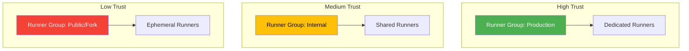
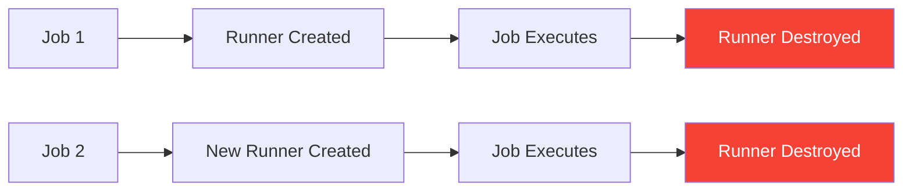

# Security Hardening

Self-hosted runners execute arbitrary code from workflows. This guide covers essential security measures to protect your infrastructure.

> [!CAUTION]
> A compromised self-hosted runner can access your network, credentials, and other resources. Security hardening is **not optional** for production use.

## 1. Runner Isolation Strategies

### Dedicated Runners per Trust Level



Best practices:

- **Never** use self-hosted runners for public repositories (forks can run arbitrary code)
- Use runner groups (Enterprise Cloud) to restrict which repos can use which runners
- Isolate production deployment runners from CI runners
- Use ephemeral runners for untrusted workloads

### Runner Group Access Policies (Enterprise Cloud)

```bash
# List runner groups
gh api orgs/YOUR-ORG/actions/runner-groups --jq '.runner_groups[] | {id, name, visibility}'

# Restrict a runner group to specific repositories
gh api orgs/YOUR-ORG/actions/runner-groups/GROUP_ID \
  -X PATCH \
  -f visibility=selected \
  -F selected_repository_ids[]="REPO_ID_1" \
  -F selected_repository_ids[]="REPO_ID_2"
```

## 2. OS-Level Hardening

### Non-Root Runner Service

The runner should NEVER run as root:

```bash
# Verify runner is not running as root
ps aux | grep Runner.Listener
# Should show 'runner' user, NOT 'root'
```

### Disable Unnecessary Services

```bash
# Disable services not needed on a runner
sudo systemctl disable bluetooth.service 2>/dev/null
sudo systemctl disable cups.service 2>/dev/null
sudo systemctl disable avahi-daemon.service 2>/dev/null

# Disable unnecessary network services
sudo systemctl disable rpcbind.service 2>/dev/null
```

### Automatic Security Updates

```bash
# Install unattended-upgrades
sudo apt-get install -y unattended-upgrades

# Enable automatic security updates
sudo dpkg-reconfigure -plow unattended-upgrades

# Verify configuration
cat /etc/apt/apt.conf.d/20auto-upgrades
# Expected:
# APT::Periodic::Update-Package-Lists "1";
# APT::Periodic::Unattended-Upgrade "1";
```

### File System Security

```bash
# Set restrictive permissions on runner directory
sudo chmod 750 /home/runner/actions-runner

# Set /tmp to noexec (prevents execution from temp directory)
# Add to /etc/fstab:
# tmpfs /tmp tmpfs defaults,noexec,nosuid,nodev 0 0

# Enable disk encryption (if not already enabled at VM creation)
# This is best done when creating the VM via --os-disk-encryption-set
```

### SSH Hardening

```bash
# Edit /etc/ssh/sshd_config
sudo tee -a /etc/ssh/sshd_config.d/hardened.conf << 'EOF'
PermitRootLogin no
PasswordAuthentication no
MaxAuthTries 3
ClientAliveInterval 300
ClientAliveCountMax 2
AllowUsers azureuser
EOF

sudo systemctl restart sshd
```

## 3. Network Security

Reference [Networking & Connectivity](04-networking-connectivity.md) for full details.

Summary of network hardening:

- **Minimal inbound**: SSH from admin IP only (or Azure Bastion)
- **Controlled outbound**: HTTPS to GitHub endpoints only
- **Private endpoints**: For Azure services (ACR, Key Vault, Storage)
- **No public IP** (production): Use Azure Bastion for management

### Remove Public IP (Production)

```bash
# Dissociate public IP from NIC
az network nic ip-config update \
  --resource-group ghrunner-rg \
  --nic-name ghrunner-vm-01-nic \
  --name ipconfig1 \
  --remove publicIpAddress

# Use Azure Bastion for SSH access instead
az network bastion create \
  --resource-group ghrunner-rg \
  --name ghrunner-bastion \
  --vnet-name ghrunner-vnet \
  --location eastus
```

## 4. Secrets Management

### Azure Key Vault Integration

```bash
# Create Key Vault
az keyvault create \
  --resource-group ghrunner-rg \
  --name ghrunner-kv \
  --location eastus

# Store a secret
az keyvault secret set \
  --vault-name ghrunner-kv \
  --name "my-api-key" \
  --value "super-secret-value"

# Grant runner's managed identity access
az keyvault set-policy \
  --name ghrunner-kv \
  --object-id <RUNNER_MANAGED_IDENTITY_PRINCIPAL_ID> \
  --secret-permissions get list
```

Using Key Vault in workflows:

```yaml
steps:
  - name: Azure Login
    uses: azure/login@v2
    with:
      client-id: ${{ secrets.AZURE_CLIENT_ID }}
      tenant-id: ${{ secrets.AZURE_TENANT_ID }}
      subscription-id: ${{ secrets.AZURE_SUBSCRIPTION_ID }}

  - name: Get Secret from Key Vault
    run: |
      SECRET=$(az keyvault secret show \
        --vault-name ghrunner-kv \
        --name my-api-key \
        --query value -o tsv)
      echo "::add-mask::$SECRET"
      echo "MY_SECRET=$SECRET" >> $GITHUB_ENV
```

### Secrets Best Practices

- Never store secrets in:
  - Runner filesystem
  - Environment variables in cloud-init
  - Workflow logs (use `::add-mask::`)
- Use GitHub repository/environment secrets for workflow-level secrets
- Use Azure Key Vault for Azure-specific secrets
- Use OIDC (no stored credentials) whenever possible

## 5. Container Security (ACI/AKS)

### Image Scanning

```bash
# Enable Microsoft Defender for container registries
az security pricing create \
  --name ContainerRegistry \
  --tier Standard

# Scan images before deployment
# Images pushed to ACR are automatically scanned
az acr repository show-tags --name ghrunneracr --repository ghrunner --output table
```

### Container Best Practices

- Use minimal base images (ubuntu:22.04, not full desktop)
- Run as non-root user (UID 1000+)
- Read-only root filesystem where possible
- No privileged containers
- Pin image tags (not `latest`)
- Regular image rebuilds for security patches

### AKS Pod Security

```yaml
# Pod security context
template:
  spec:
    securityContext:
      runAsNonRoot: true
      runAsUser: 1000
      fsGroup: 1000
    containers:
      - name: runner
        securityContext:
          allowPrivilegeEscalation: false
          readOnlyRootFilesystem: false  # Runner needs write access
          capabilities:
            drop: ["ALL"]
```

## 6. Ephemeral Runners

Ephemeral runners are the strongest isolation pattern:



Benefits:

- Clean environment for every job
- No cross-job contamination
- No persistent malware
- No credential accumulation

Configure ephemeral mode:

```bash
# VM: configure with --ephemeral flag
./config.sh --url https://github.com/ORG --token TOKEN --ephemeral

# ARC: Default mode (runners are always ephemeral)
# ACI: Use --restart-policy Never
```

## 7. Audit and Compliance

### GitHub Enterprise Audit Log

```bash
# Query audit log for runner events
gh api orgs/YOUR-ORG/audit-log \
  --jq '.[] | select(.action | startswith("org.runner_group")) | {action, actor, created_at}'

# Runner-related audit events:
# - org.runner_group_created
# - org.runner_group_updated
# - org.runner_group_runners_added
# - org.runner_group_runners_removed
# - repo.self_hosted_runner_online
# - repo.self_hosted_runner_offline
```

### Azure Activity Log

```bash
# View recent activity on runner resources
az monitor activity-log list \
  --resource-group ghrunner-rg \
  --offset 24h \
  --query "[].{Time:eventTimestamp, Op:operationName.value, Status:status.value}" \
  --output table
```

### Azure Policy for Compliance

```bash
# Example: Enforce VM encryption policy
az policy assignment create \
  --name "require-disk-encryption" \
  --policy "0961003e-5a0a-4549-abce-af6a11b57b3c" \
  --scope "/subscriptions/$SUBSCRIPTION_ID/resourceGroups/ghrunner-rg"
```

## 8. Threat Model Summary

| Threat | Risk | Mitigation |
|--------|:----:|------------|
| Malicious Action from Marketplace | 🔴 High | Pin actions to SHA, review before use, `allowed-actions` policy |
| Credential theft from runner | 🔴 High | OIDC (no stored creds), Key Vault, ephemeral runners |
| Cross-job contamination | 🟡 Medium | Ephemeral runners, dedicated runners per trust level |
| Supply chain attack (compromised dependency) | 🟡 Medium | Dependency review, lockfiles, private registries |
| Lateral movement from runner | 🔴 High | Network segmentation, NSG, minimal permissions |
| Secrets in workflow logs | 🟡 Medium | `::add-mask::`, audit log monitoring |
| Runner application vulnerability | 🟢 Low | Auto-update enabled, monitor security advisories |
| Denial of service (resource exhaustion) | 🟡 Medium | Resource limits, max runners cap, monitoring |

## 9. Security Checklist

- [ ] Runner runs as non-root user
- [ ] SSH hardened (no root login, key-only, restricted users)
- [ ] NSG allows only necessary traffic
- [ ] No public IP (use Azure Bastion) — production
- [ ] Automatic OS security updates enabled
- [ ] Secrets stored in Key Vault, not filesystem
- [ ] OIDC used for Azure authentication (no stored secrets)
- [ ] Runner groups restrict repository access
- [ ] Ephemeral runners for untrusted workloads
- [ ] Actions pinned to commit SHA (not tags)
- [ ] Audit logging enabled and monitored
- [ ] Container images scanned for vulnerabilities
- [ ] Disk encryption enabled

---

← **Previous:** [OIDC & Workload Identity](10-oidc-workload-identity.md) | **Next:** [Monitoring & Maintenance](12-monitoring-maintenance.md) →
