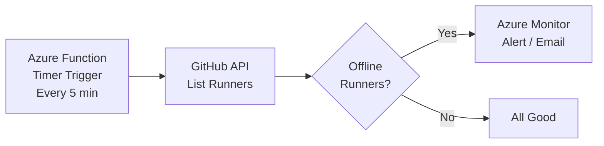

# Monitoring and Maintenance

Keeping runners healthy, updated, and monitored is critical for reliable CI/CD. This guide covers monitoring, logging, updates, troubleshooting, and decommissioning.

## 1. Monitoring Runner Health

### GitHub API — Runner Status

```bash
# List all runners for a repository
gh api repos/OWNER/REPO/actions/runners \
  --jq '.runners[] | {id, name, status, busy, labels: [.labels[].name]}'

# List all runners for an organization
gh api orgs/YOUR-ORG/actions/runners \
  --jq '.runners[] | {id, name, status, busy, labels: [.labels[].name]}'

# Check specific runner
gh api repos/OWNER/REPO/actions/runners/RUNNER_ID \
  --jq '{name, status, busy, os, architecture}'
```

### Health Check Script

```bash
#!/bin/bash
# runner-health-check.sh — Monitor runner status

ORG="YOUR-ORG"
echo "=== Runner Health Report ==="
echo "Time: $(date -u +%Y-%m-%dT%H:%M:%SZ)"
echo ""

# Get runners
RUNNERS=$(gh api orgs/$ORG/actions/runners --jq '.runners[] | "\(.name)|\(.status)|\(.busy)"')

ONLINE=0; OFFLINE=0; BUSY=0
while IFS='|' read -r name status busy; do
  if [ "$status" = "online" ]; then
    ((ONLINE++))
    if [ "$busy" = "true" ]; then
      ((BUSY++))
      echo "🔵 $name — busy"
    else
      echo "🟢 $name — idle"
    fi
  else
    ((OFFLINE++))
    echo "🔴 $name — OFFLINE"
  fi
done <<< "$RUNNERS"

echo ""
echo "Summary: $ONLINE online ($BUSY busy), $OFFLINE offline"
if [ $OFFLINE -gt 0 ]; then
  echo "⚠️  WARNING: $OFFLINE runner(s) offline!"
  exit 1
fi
```

### Azure Monitor for VM Runners

```bash
# Enable Azure Monitor Agent
az vm extension set \
  --resource-group ghrunner-rg \
  --vm-name ghrunner-vm-01 \
  --name AzureMonitorLinuxAgent \
  --publisher Microsoft.Azure.Monitor

# Key metrics to monitor:
# - CPU utilization (sustained > 80% = undersized)
# - Memory utilization (sustained > 85% = undersized)
# - Disk I/O (high IOPS = consider Premium SSD)
# - Network out (sustained high = large artifacts/images)
```

### Azure Monitor for AKS

```bash
# Enable Container Insights
az aks enable-addons \
  --resource-group ghrunner-rg \
  --name ghrunner-aks \
  --addons monitoring

# View in Azure Portal:
# AKS cluster → Insights → Containers → filter by arc-runners namespace
```

## 2. Runner Application Logs

### Log Locations

| Platform | Log Location |
|----------|-------------|
| VM (service) | `/home/runner/actions-runner/_diag/` |
| VM (systemd) | `journalctl -u actions.runner.*.service` |
| ACI | `az container logs --name <name>` |
| AKS/ARC | `kubectl logs -n arc-runners <pod>` |

### Log Types

- **Runner logs** (`Runner_*.log`): Registration, connection, job assignment
- **Worker logs** (`Worker_*.log`): Job execution, step output
- **Job logs** (`pages/*.log`): Individual step output (temporary)

```bash
# View recent runner logs on VM
ls -lt /home/runner/actions-runner/_diag/Runner_*.log | head -3
tail -100 /home/runner/actions-runner/_diag/Runner_$(date +%Y%m%d)*.log

# View systemd service logs
sudo journalctl -u actions.runner.*.service --since "1 hour ago" --no-pager

# View real-time logs
sudo journalctl -u actions.runner.*.service -f
```

## 3. Centralized Logging with Azure Log Analytics

### Create Log Analytics Workspace

```bash
# Create workspace
az monitor log-analytics workspace create \
  --resource-group ghrunner-rg \
  --workspace-name ghrunner-logs \
  --location eastus

# Get workspace ID and key
WORKSPACE_ID=$(az monitor log-analytics workspace show \
  --resource-group ghrunner-rg \
  --workspace-name ghrunner-logs \
  --query customerId -o tsv)

WORKSPACE_KEY=$(az monitor log-analytics workspace get-shared-keys \
  --resource-group ghrunner-rg \
  --workspace-name ghrunner-logs \
  --query primarySharedKey -o tsv)
```

### Sample KQL Queries

```kql
// CPU usage over time for runner VM
Perf
| where Computer == "ghrunner-vm-01"
| where CounterName == "% Processor Time"
| summarize AvgCPU = avg(CounterValue) by bin(TimeGenerated, 5m)
| render timechart

// Memory usage
Perf
| where Computer == "ghrunner-vm-01"
| where CounterName == "% Used Memory"
| summarize AvgMem = avg(CounterValue) by bin(TimeGenerated, 5m)
| render timechart

// Disk space alerts
Perf
| where CounterName == "% Used Space"
| where CounterValue > 85
| project TimeGenerated, Computer, InstanceName, CounterValue
```

## 4. Alerting

### Runner Offline Alert (Azure Function + GitHub API)

Concept:



Simple monitoring with cron:

```bash
# Add to crontab on a monitoring VM
# crontab -e
*/5 * * * * /usr/local/bin/runner-health-check.sh >> /var/log/runner-health.log 2>&1
```

### Azure Monitor Alerts for VM

```bash
# Alert when CPU > 90% for 10 minutes
az monitor metrics alert create \
  --resource-group ghrunner-rg \
  --name "runner-high-cpu" \
  --scopes $(az vm show -g ghrunner-rg -n ghrunner-vm-01 --query id -o tsv) \
  --condition "avg Percentage CPU > 90" \
  --window-size 10m \
  --evaluation-frequency 5m \
  --description "Runner VM CPU is critically high"
```

## 5. Runner Updates

### Automatic Self-Update

The runner application updates itself automatically:

- When GitHub releases a new runner version
- The runner downloads and installs the update
- The service restarts automatically
- Logs: `Runner_*.log` shows update entries

Verify current version:

```bash
# On the VM
cat /home/runner/actions-runner/bin/Runner.Listener.deps.json | grep -o '"Microsoft.VisualStudio.Services.Agent"[^}]*' | head -1

# Or check the runner process
/home/runner/actions-runner/bin/Runner.Listener --version

# Via GitHub API
gh api repos/OWNER/REPO/actions/runners --jq '.runners[] | {name, version: .runner_version}'
```

### Disable Auto-Update (if required by policy)

Create a file to prevent auto-updates:

```bash
touch /home/runner/actions-runner/.env
echo "RUNNER_ALLOW_SELF_UPDATE=false" >> /home/runner/actions-runner/.env
# Note: Runner may stop working if too far behind the required version
```

### Manual Update

```bash
# Stop the service
sudo /home/runner/actions-runner/svc.sh stop

# Download new version
cd /home/runner/actions-runner
curl -o actions-runner-linux-x64-NEW_VERSION.tar.gz -L \
  https://github.com/actions/runner/releases/download/vNEW_VERSION/actions-runner-linux-x64-NEW_VERSION.tar.gz
tar xzf actions-runner-linux-x64-NEW_VERSION.tar.gz

# Start the service
sudo /home/runner/actions-runner/svc.sh start
```

## 6. OS and Image Maintenance

### Ubuntu Security Patches

```bash
# Check for security updates
sudo apt list --upgradable 2>/dev/null | grep -i security

# Apply security updates only
sudo unattended-upgrade -d

# Full update
sudo apt-get update && sudo apt-get upgrade -y

# Check if reboot needed
[ -f /var/run/reboot-required ] && echo "REBOOT REQUIRED" || echo "No reboot needed"
```

### Container Image Rebuild Schedule

For ACI/AKS runners, rebuild images regularly:

```bash
# Rebuild with latest base image and runner version
cd containers/runner
docker build --no-cache -t ghrunneracr.azurecr.io/ghrunner:$(date +%Y%m%d) .
docker push ghrunneracr.azurecr.io/ghrunner:$(date +%Y%m%d)

# Also update :latest tag
docker tag ghrunneracr.azurecr.io/ghrunner:$(date +%Y%m%d) ghrunneracr.azurecr.io/ghrunner:latest
docker push ghrunneracr.azurecr.io/ghrunner:latest
```

> [!TIP]
> Automate image rebuilds with a GitHub Actions workflow that runs on a schedule (weekly or monthly).

### AKS Node Image Upgrades

```bash
# Check available upgrades
az aks nodepool get-upgrades \
  --resource-group ghrunner-rg \
  --cluster-name ghrunner-aks \
  --nodepool-name nodepool1

# Upgrade node image
az aks nodepool upgrade \
  --resource-group ghrunner-rg \
  --cluster-name ghrunner-aks \
  --name nodepool1 \
  --node-image-only
```

## 7. Troubleshooting Common Issues

| Symptom | Possible Cause | Diagnosis | Solution |
|---------|---------------|-----------|----------|
| Runner shows "Offline" | Service crashed | `sudo systemctl status actions.runner.*.service` | `sudo ./svc.sh start` |
| Runner shows "Offline" | Network issue | Run connectivity test script | Check NSG rules, DNS |
| Runner shows "Offline" | VM deallocated | `az vm show -d -g RG -n VM --query powerState` | `az vm start -g RG -n VM` |
| Runner not picking up jobs | Label mismatch | Compare `runs-on` with runner labels | Update labels or workflow |
| Runner not picking up jobs | Runner group restriction | Check group → repo access policy | Add repo to runner group |
| Job timeouts | Insufficient resources | Check CPU/memory during job | Resize VM / increase limits |
| "Could not resolve host" | DNS failure | `nslookup github.com` | Check DNS, /etc/resolv.conf |
| Permission denied | File ownership | `ls -la /home/runner/actions-runner/` | `chown -R runner:runner ...` |
| Docker permission denied | Not in docker group | `groups runner` | `sudo usermod -aG docker runner` |
| Out of disk space | Accumulated artifacts | `df -h`, check `_work/` size | Clean `_work/`, add disk |
| ARC: CrashLoopBackOff | Bad credentials | `kubectl logs -n arc-systems <pod>` | Recreate GitHub App secret |
| ARC: Pods pending | No nodes available | `kubectl describe pod <pod>` | Check cluster autoscaler |
| ACI: Container restart loop | Token expired | `az container logs` | Deploy with fresh token |

### Diagnostic Commands Cheat Sheet

```bash
# === VM Runner ===
# Service status
sudo systemctl status actions.runner.*.service

# Recent logs
sudo journalctl -u actions.runner.*.service --since "30 min ago" --no-pager

# Runner process
ps aux | grep Runner.Listener

# Disk space
df -h /home/runner

# Network connectivity
curl -sS -o /dev/null -w "%{http_code}" https://api.github.com

# === AKS/ARC ===
# Controller status
kubectl get pods -n arc-systems

# Runner pods
kubectl get pods -n arc-runners

# Controller logs
kubectl logs -n arc-systems -l app.kubernetes.io/name=gha-runner-scale-set-controller --tail=50

# ARC custom resources
kubectl get autoscalingrunnersets,ephemeralrunnersets,ephemeralrunners -n arc-runners

# === ACI ===
# Container status
az container show -g ghrunner-rg -n ghrunner-aci-01 --query instanceView.state

# Container logs
az container logs -g ghrunner-rg -n ghrunner-aci-01
```

## 8. Cleanup and Decommissioning

### Decommission a VM Runner

```bash
# 1. Remove runner from GitHub
cd /home/runner/actions-runner
REMOVE_TOKEN=$(gh api repos/OWNER/REPO/actions/runners/remove-token -X POST --jq '.token')
./config.sh remove --token $REMOVE_TOKEN

# 2. Stop and disable service
sudo ./svc.sh stop
sudo ./svc.sh uninstall

# 3. Delete VM
az vm delete -g ghrunner-rg -n ghrunner-vm-01 --yes

# 4. Clean up associated resources
az network nic delete -g ghrunner-rg -n ghrunner-vm-01-nic
az network public-ip delete -g ghrunner-rg -n ghrunner-vm-01-ip
az disk delete -g ghrunner-rg -n ghrunner-vm-01_OsDisk --yes
```

### Decommission All Resources

```bash
# Nuclear option — delete everything
az group delete --name ghrunner-rg --yes --no-wait
echo "Resource group deletion initiated (may take a few minutes)"
```

---

← **Previous:** [Security Hardening](11-security-hardening.md) | **Next:** [Sample Workflows](13-sample-workflows.md) →
