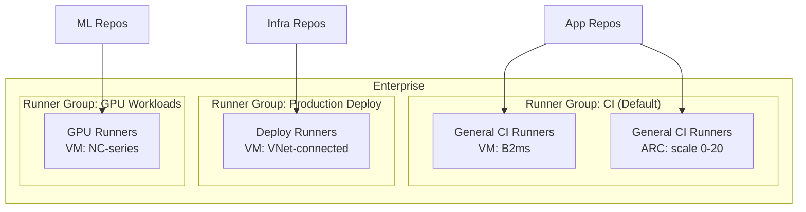
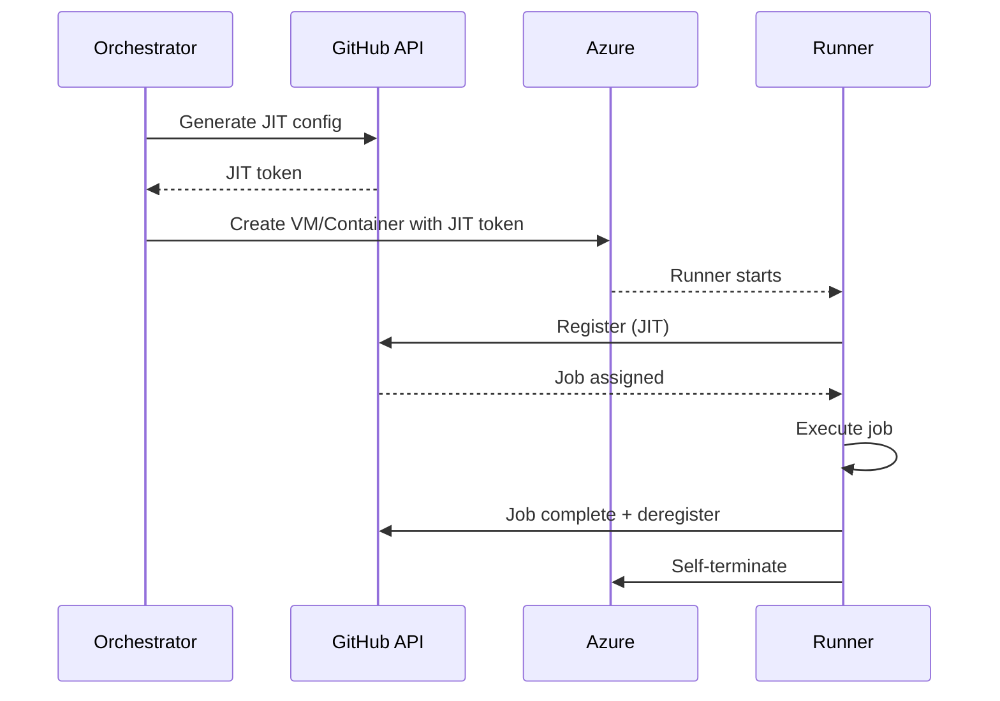
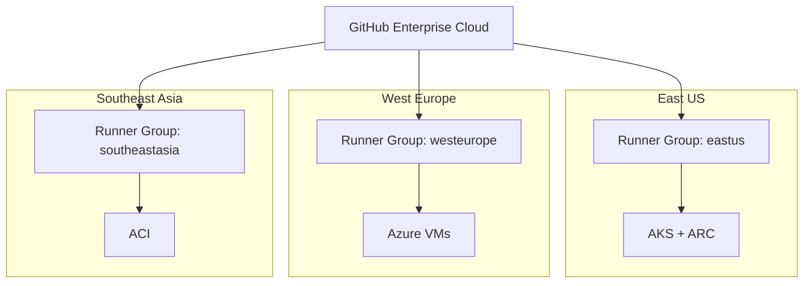

# Advanced Enterprise Topics

This guide covers enterprise-grade patterns for managing self-hosted runners at scale with GitHub Enterprise Cloud.

## Runner Groups

> [!IMPORTANT]
> Runner groups are a **GitHub Enterprise Cloud** feature. They allow you to control which repositories and workflows can use specific runners.

### Creating Runner Groups

**Via GitHub UI:**
1. Organization → Settings → Actions → Runner groups
2. Click "New runner group"
3. Configure: name, visibility, repository access

**Via REST API:**
```bash
# Create a runner group
gh api orgs/YOUR-ORG/actions/runner-groups \
  -X POST \
  -f name="production-runners" \
  -f visibility="selected" \
  -F selected_repository_ids[]="REPO_ID_1" \
  -F selected_repository_ids[]="REPO_ID_2"

# List runner groups
gh api orgs/YOUR-ORG/actions/runner-groups --jq '.runner_groups[] | {id, name, visibility, default}'

# Add a runner to a group
gh api orgs/YOUR-ORG/actions/runner-groups/GROUP_ID/runners \
  -X PUT \
  -F runners[]=RUNNER_ID
```

### Repository Access Policies

```bash
# Set group to allow only specific repositories
gh api orgs/YOUR-ORG/actions/runner-groups/GROUP_ID \
  -X PATCH \
  -f visibility="selected"

# Add repository to group
gh api orgs/YOUR-ORG/actions/runner-groups/GROUP_ID/repositories/REPO_ID -X PUT

# Remove repository from group
gh api orgs/YOUR-ORG/actions/runner-groups/GROUP_ID/repositories/REPO_ID -X DELETE

# List repositories with access
gh api orgs/YOUR-ORG/actions/runner-groups/GROUP_ID/repositories --jq '.repositories[].full_name'
```

### Workflow Targeting

```yaml
jobs:
  deploy:
    # Target a specific runner group
    runs-on:
      group: production-runners
      labels: [linux, x64]
```

### Runner Group Strategy Pattern



## Enterprise vs Organization vs Repository Scope

| Scope | Who Can Register | Visibility | Runner Groups |
|-------|:----------------:|:----------:|:-------------:|
| **Enterprise** | Enterprise Owners | All orgs in enterprise | ✅ Enterprise groups |
| **Organization** | Organization Owners | All repos in org | ✅ Org groups |
| **Repository** | Repository Admins | Single repo only | ❌ N/A |

```bash
# Register at organization level (recommended for shared runners)
./config.sh --url https://github.com/YOUR-ORG --token TOKEN

# Register at repository level (for dedicated runners)
./config.sh --url https://github.com/YOUR-ORG/YOUR-REPO --token TOKEN
```

Best practices:
- Register runners at the **organization** level for sharing across repos
- Use **runner groups** to control access (not repo-level registration)
- Only use repo-level runners for truly dedicated/isolated workloads

## Custom Labels and Routing

### Label Taxonomy Design

| Label Category | Examples | Purpose |
|---------------|---------|---------|
| Platform | `azure`, `aws`, `on-prem` | Cloud provider |
| Environment | `dev`, `staging`, `production` | Deployment target |
| Capability | `docker`, `gpu`, `large-disk` | Special features |
| Network | `vnet`, `private`, `public` | Network location |
| Size | `small`, `medium`, `large` | Resource capacity |
| Region | `eastus`, `westeurope` | Geographic location |

### Routing Examples

```yaml
# Route to production runners with VNet access
runs-on: [self-hosted, linux, azure, production, vnet]

# Route to GPU runners
runs-on: [self-hosted, linux, gpu]

# Route to specific region for data residency
runs-on: [self-hosted, linux, azure, westeurope]

# Route to large runners for heavy builds
runs-on: [self-hosted, linux, azure, large]
```

### Managing Labels

```bash
# Add labels to existing runner (via API)
gh api repos/OWNER/REPO/actions/runners/RUNNER_ID/labels \
  -X POST \
  -F labels[]="production" \
  -F labels[]="vnet"

# Remove a label
gh api repos/OWNER/REPO/actions/runners/RUNNER_ID/labels/production -X DELETE

# Replace all custom labels
gh api repos/OWNER/REPO/actions/runners/RUNNER_ID/labels \
  -X PUT \
  -F labels[]="azure" \
  -F labels[]="production" \
  -F labels[]="vnet"
```

## Ephemeral Runners at Scale

### JIT Configuration Pattern



### One-Job-Per-VM Pattern

```bash
#!/bin/bash
# orchestrate-ephemeral.sh — Create an ephemeral VM runner

GITHUB_ORG="YOUR-ORG"
RUNNER_NAME="ephemeral-$(date +%s)"

# Generate JIT config
JIT_CONFIG=$(gh api repos/$GITHUB_ORG/YOUR-REPO/actions/runners/generate-jitconfig \
  -X POST \
  -f name="$RUNNER_NAME" \
  -F runner_group_id=1 \
  -F labels[]="self-hosted" \
  -F labels[]="linux" \
  -F labels[]="ephemeral" \
  -f work_folder="_work" \
  --jq '.encoded_jit_config')

# Create cloud-init that uses JIT config
cat > /tmp/jit-cloud-init.yaml << EOF
#cloud-config
runcmd:
  - |
    RUNNER_DIR="/home/runner/actions-runner"
    mkdir -p \$RUNNER_DIR && cd \$RUNNER_DIR
    curl -sL https://github.com/actions/runner/releases/download/v2.321.0/actions-runner-linux-x64-2.321.0.tar.gz | tar xz
    chown -R runner:runner \$RUNNER_DIR
    su - runner -c "cd \$RUNNER_DIR && ./run.sh --jitconfig $JIT_CONFIG"
    # VM self-destructs after job
    shutdown -h now
EOF

# Create VM
az vm create \
  --resource-group ghrunner-rg \
  --name "$RUNNER_NAME" \
  --image Ubuntu2204 \
  --size Standard_B2s \
  --admin-username azureuser \
  --generate-ssh-keys \
  --custom-data /tmp/jit-cloud-init.yaml \
  --no-wait
```

### ARC Ephemeral Mode

ARC runners are ephemeral by default:
- Each pod handles exactly one job
- Pod is destroyed after job completion
- New pod is created for next job
- No state persists between jobs

## Cost Optimization

### Azure Spot VMs

Save up to 90% for interruptible workloads:
```bash
az vm create \
  --resource-group ghrunner-rg \
  --name ghrunner-spot \
  --image Ubuntu2204 \
  --size Standard_D2s_v5 \
  --priority Spot \
  --eviction-policy Deallocate \
  --max-price 0.03 \
  --admin-username azureuser \
  --generate-ssh-keys
```

> [!WARNING]
> Spot VMs can be evicted at any time. Only use for non-critical, retryable workloads (linting, testing). NOT for deployments.

### Auto-Shutdown Idle VMs

```bash
# Enable auto-shutdown at 7 PM
az vm auto-shutdown \
  --resource-group ghrunner-rg \
  --name ghrunner-vm-01 \
  --time 1900

# Script to stop idle runners (no jobs in 30 min)
#!/bin/bash
RUNNER_STATUS=$(gh api orgs/YOUR-ORG/actions/runners \
  --jq '.runners[] | select(.name == "ghrunner-vm-01") | .busy')
if [ "$RUNNER_STATUS" = "false" ]; then
  echo "Runner idle — deallocating VM"
  az vm deallocate -g ghrunner-rg -n ghrunner-vm-01 --no-wait
fi
```

### Reserved Instances

For steady-state runners that run 24/7:
- 1-year reserved: ~30% savings
- 3-year reserved: ~55% savings
- Calculate: if VM runs > 60% of the month, reserved instances save money

### Right-Sizing Guide

| Workload Type | Recommended Size | Monthly Cost* |
|--------------|-----------------|:------------:|
| Linting, simple tests | Standard_B2s (2 vCPU, 4 GB) | ~$30 |
| General CI/CD | Standard_B2ms (2 vCPU, 8 GB) | ~$60 |
| Docker builds | Standard_D2s_v5 (2 vCPU, 8 GB) | ~$70 |
| Large compilations | Standard_D4s_v5 (4 vCPU, 16 GB) | ~$140 |
| Monorepo builds | Standard_D8s_v5 (8 vCPU, 32 GB) | ~$280 |
| ML/GPU workloads | Standard_NC4as_T4_v3 | ~$350 |

*Approximate pay-as-you-go prices, East US.

### AKS Cost Optimization

```bash
# Enable cluster autoscaler (scale to zero when idle)
az aks update \
  --resource-group ghrunner-rg \
  --name ghrunner-aks \
  --enable-cluster-autoscaler \
  --min-count 0 \
  --max-count 5

# Use Spot node pools for runner workloads
az aks nodepool add \
  --resource-group ghrunner-rg \
  --cluster-name ghrunner-aks \
  --name spotpool \
  --priority Spot \
  --eviction-policy Delete \
  --spot-max-price -1 \
  --node-count 0 \
  --min-count 0 \
  --max-count 10 \
  --enable-cluster-autoscaler
```

## Multi-Region Deployment

### Why Multi-Region?

- **Latency**: Runners close to Azure resources they deploy to
- **Data residency**: Build in the same region as data (compliance)
- **Resilience**: If one region has issues, others continue working

### Pattern: Runner Group per Region



Workflow targeting by region:
```yaml
jobs:
  deploy-us:
    runs-on:
      group: eastus-runners
  
  deploy-eu:
    runs-on:
      group: westeurope-runners
```

## Disaster Recovery

Key insight: **Runners are stateless**. DR is about re-provisioning speed, not data recovery.

| Strategy | RTO | Cost |
|----------|:---:|:----:|
| Multi-region active-active | ~0 (automatic failover) | High (2x infrastructure) |
| IaC rapid re-deploy | ~15-30 min | Low (pay only when needed) |
| Multi-region active-passive | ~5-10 min | Medium (standby runners) |

Best practices:
- Store all runner infrastructure as IaC (Bicep) in version control
- Test re-provisioning regularly
- Multi-region runner groups provide natural resilience
- Monitor runner health and alert on offline runners

## Compliance

### Data Handling on Runners

- Source code is cloned to the runner during job execution
- Job artifacts may contain sensitive data
- Runner `_work` directory persists between jobs (non-ephemeral)
- Clean the work directory: `./config.sh --clean` flag

### Log Retention

- Runner diagnostic logs: stored on runner, configure retention
- GitHub Actions logs: retained per organization settings (default 400 days for Enterprise)
- Azure Activity Logs: retained per subscription settings

### Regulatory Considerations

| Regulation | Runner Requirement |
|-----------|-------------------|
| SOC 2 | Access controls, audit logging, encryption |
| ISO 27001 | Information security management |
| GDPR | Data residency (EU runners for EU data) |
| HIPAA | Encryption at rest and in transit, access controls |
| FedRAMP | Azure Government regions, IL4/IL5 compliance |

## Enterprise Actions Policies

### Allowed Actions

```bash
# Set allowed actions policy for organization
gh api orgs/YOUR-ORG/actions/permissions \
  -X PUT \
  -f enabled_repositories="all" \
  -f allowed_actions="selected"

# Allow specific actions
gh api orgs/YOUR-ORG/actions/permissions/selected-actions \
  -X PUT \
  -F github_owned_allowed=true \
  -F verified_creator_allowed=true \
  -F patterns_allowed[]="azure/*"
```

### Required Workflows (Enterprise Cloud)

```bash
# Create required workflow
gh api orgs/YOUR-ORG/actions/required_workflows \
  -X POST \
  -f workflow_file_path=".github/workflows/security-scan.yml" \
  -f repository_id=REPO_ID \
  -f scope="all"
```

## Navigation

---

← **Previous:** [Sample Workflows](13-sample-workflows.md) | **Next:** [Copilot Coding Agent on Self-Hosted](15-copilot-coding-agent.md) →
