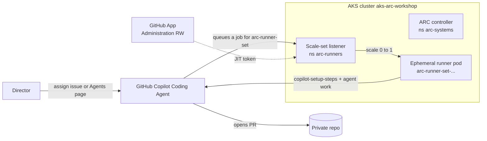

# End-to-End: Copilot Coding Agent on a Private Repo (AKS + ARC + GitHub App)

> **A single, reproducible walkthrough** — from an empty Azure subscription to a GitHub Copilot Coding Agent that builds and tests your **private** repository on your own **AKS + Actions Runner Controller (ARC)** runners.

This chapter stitches together pieces that live elsewhere and adds the steps that are easy to miss:

- [09 — AKS + ARC Setup](09-aks-arc-setup.md) is the **reference** for ARC on Kubernetes (organization-level, deep dive).
- [15 — Copilot Coding Agent on Self-Hosted](15-copilot-coding-agent.md) is the **field guide** to the four hard requirements.
- **This chapter (16)** is the **linear recipe for one private repository** under a *personal* account — including the bits not covered elsewhere: deriving the App **installation ID with a JWT**, **safe handling of the private key**, the **`copilot-setup-steps.yml` on the default branch**, and **proving the agent actually ran on an ARC pod**.

> [!NOTE]
> Everything below was executed end-to-end against a real **private** repo. Where useful, a **Worked example** box shows the exact names and outputs from that run. The App private key is never shown.

---

## Why this combination?

For a **private** repository the Copilot coding agent cannot use a vanilla self-hosted runner — it fails early with `Repository not found`, because the token it receives lacks the scopes its git plumbing needs. **ARC authenticated by a GitHub App** mints tokens with the right scopes, so the agent works. See [15 §4](15-copilot-coding-agent.md#4-private-repos-arc-vs-vanilla-self-hosted).

The four hard requirements (from [15](15-copilot-coding-agent.md)) and where this guide handles them:

| # | Requirement | Handled in |
|---|-------------|-----------|
| 1 | `.github/workflows/copilot-setup-steps.yml` (job `copilot-setup-steps`, correct `runs-on`) | Step 7 |
| 2 | Repository **agent firewall OFF** | Step 6 |
| 3 | **Ephemeral** runners | native to ARC (each job = a fresh pod) |
| 4 | **ARC + GitHub App** for private repos | Steps 2–5 |

---

## Architecture



---

## Prerequisites

- An **Azure subscription** and the **Azure CLI** (`az`), logged in (`az login`).
- **kubectl** and **Helm 3** (`helm version`).
- The **GitHub CLI** (`gh`), authenticated (`gh auth status`).
- A **private GitHub repository** where the Copilot coding agent is enabled.

> [!TIP]
> This guide targets a **single repository** under a **personal account**. For an organization-wide setup (org-level App, runner groups), use [09 — AKS + ARC Setup](09-aks-arc-setup.md); the mechanics are identical.

---

## Variables

```bash
# Azure
export RG=rg-arc-workshop
export LOCATION=eastus
export AKS=aks-arc-workshop

# GitHub (replace OWNER/PRIVATE-REPO)
export REPO_URL=https://github.com/OWNER/PRIVATE-REPO

# Kubernetes / ARC
export NS_CONTROLLER=arc-systems
export NS_RUNNERS=arc-runners
export SCALE_SET=arc-runner-set      # == Helm release name == runs-on label
export SECRET_NAME=arc-github-app
```

> [!IMPORTANT]
> `SCALE_SET` is the single most important name: the Helm **release name** of the scale set **becomes the `runs-on` label**. Your workflows must use exactly this value.

---

## Step 1 — Create the AKS cluster

```bash
# Register the provider once per subscription (can take a few minutes)
az provider register -n Microsoft.ContainerService --wait

az group create -n "$RG" -l "$LOCATION"

az aks create -g "$RG" -n "$AKS" -l "$LOCATION" \
  --node-count 1 --node-vm-size Standard_D2s_v3 \
  --generate-ssh-keys --tier free

az aks get-credentials -g "$RG" -n "$AKS" --overwrite-existing
kubectl get nodes
```

> [!NOTE]
> **Worked example** — one `Standard_D2s_v3` node, AKS `--tier free`, ~6 minutes to provision; the node came up `Ready` on Kubernetes v1.34.8. A single 2-vCPU node comfortably runs the controller plus one or two ephemeral runners.

---

## Step 2 — Install the ARC controller

```bash
helm install arc \
  --namespace "$NS_CONTROLLER" --create-namespace \
  oci://ghcr.io/actions/actions-runner-controller-charts/gha-runner-scale-set-controller

kubectl get pods -n "$NS_CONTROLLER"   # expect arc-gha-rs-controller-... Running
```

> [!NOTE]
> **Worked example** — chart `gha-runner-scale-set-controller` **0.14.2**; the `arc-gha-rs-controller-*` pod reached `1/1 Running` in ~20 seconds.

---

## Step 3 — Create the GitHub App (repo-level)

ARC authenticates as a **GitHub App** (not a PAT) — this is what gives the Copilot agent's git operations the token scopes it needs on a private repo (requirement #4).

1. Go to **https://github.com/settings/apps → New GitHub App** (personal account; for an org use **Org → Settings → Developer settings → GitHub Apps**).
2. **Name**: e.g. `arc-<your-repo>` (globally unique). **Homepage URL**: the repo URL.
3. **Webhook**: uncheck **Active** (ARC does not use webhooks).
4. **Repository permissions**:

   | Permission | Access |
   |-----------|--------|
   | Administration | **Read and write** |
   | Metadata | Read-only (auto) |

5. **Where can this App be installed?** → **Only on this account** → **Create GitHub App**.
6. **Note the App ID** (top of the App settings page).
7. **Generate a private key** → save the downloaded `.pem`.
8. **Install App** (left sidebar) → install on your account → **Only select repositories** → choose your private repo → **Install**.

> [!NOTE]
> **Worked example** — a personal-account App with only **Administration: Read & write** + **Metadata: Read**, installed on one private repo. An *organization* setup additionally grants **Organization → Self-hosted runners: Read & write**, per [09 Part 2](09-aks-arc-setup.md#part-2-create-github-app-for-arc-authentication).

### Get the Installation ID — from the URL, or via a JWT

The Helm chart needs the **installation ID**. Read it from the install URL (`.../settings/installations/<INSTALLATION_ID>`), or derive it from the App ID + private key:

```bash
APP_ID=<APP_ID>
PEM=./arc-app.private-key.pem

python3 - "$APP_ID" "$PEM" <<'PY'
import sys, time, json, base64, urllib.request
app_id, pem = sys.argv[1], sys.argv[2]
key = open(pem, "rb").read()
try:
    import jwt  # PyJWT, if installed
    now = int(time.time())
    tok = jwt.encode({"iat": now-60, "exp": now+540, "iss": app_id}, key, algorithm="RS256")
    tok = tok.decode() if isinstance(tok, bytes) else tok
except Exception:  # fall back to 'cryptography'
    from cryptography.hazmat.primitives import hashes, serialization
    from cryptography.hazmat.primitives.asymmetric import padding
    b = lambda x: base64.urlsafe_b64encode(x).rstrip(b"=")
    now = int(time.time())
    seg = b(json.dumps({"alg": "RS256", "typ": "JWT"}).encode()) + b"." \
        + b(json.dumps({"iat": now-60, "exp": now+540, "iss": app_id}).encode())
    sig = serialization.load_pem_private_key(key, None).sign(seg, padding.PKCS1v15(), hashes.SHA256())
    tok = (seg + b"." + b(sig)).decode()
req = urllib.request.Request(
    "https://api.github.com/app/installations",
    headers={"Authorization": "Bearer " + tok, "Accept": "application/vnd.github+json",
             "User-Agent": "arc-setup", "X-GitHub-Api-Version": "2022-11-28"})
for inst in json.load(urllib.request.urlopen(req)):
    print("installation_id =", inst["id"], "| account =", inst["account"]["login"])
PY
```

> [!NOTE]
> **Worked example** — this returned a single installation (the personal account) in one call, confirming the App could see the repo. The reusable `arc-provisioning-runbook` used this exact JWT trick because the install URL was not handy.

---

## Step 4 — Create the Kubernetes secret (handle the key safely)

The scale set reads the App credentials from a Kubernetes secret. Treat the `.pem` as sensitive: write it with restrictive permissions, create the secret, then shred the local copy.

```bash
umask 077                                   # newly written files are 0600
# (place your downloaded key at ./arc-app.private-key.pem)

kubectl create namespace "$NS_RUNNERS" 2>/dev/null || true

kubectl create secret generic "$SECRET_NAME" \
  --namespace "$NS_RUNNERS" \
  --from-literal=github_app_id=<APP_ID> \
  --from-literal=github_app_installation_id=<INSTALLATION_ID> \
  --from-file=github_app_private_key=./arc-app.private-key.pem

shred -u ./arc-app.private-key.pem          # remove the local plaintext key
```

> [!WARNING]
> The private key now lives **only** inside the cluster secret (encrypted at rest in etcd) — that is required for ARC to mint tokens. Never commit the `.pem`, never echo it, and rotate it from the App settings if it is ever exposed.

The chart accepts a **pre-defined secret**: its keys must be exactly `github_app_id`, `github_app_installation_id`, and `github_app_private_key` (the names used above).

---

## Step 5 — Deploy the runner scale set

```bash
helm install "$SCALE_SET" \
  --namespace "$NS_RUNNERS" --create-namespace \
  --set githubConfigUrl="$REPO_URL" \
  --set githubConfigSecret="$SECRET_NAME" \
  --set runnerScaleSetName="$SCALE_SET" \
  --set minRunners=0 --set maxRunners=4 \
  oci://ghcr.io/actions/actions-runner-controller-charts/gha-runner-scale-set

# Verify: the listener registers the scale set with GitHub
kubectl get pods -n "$NS_CONTROLLER" | grep listener
gh api repos/OWNER/PRIVATE-REPO/actions/runners --jq '.runners[]? | {name, status}'
```

A `*-listener` pod in `arc-systems` long-polls GitHub for jobs targeting `arc-runner-set`. With `minRunners=0`, no runner pods exist until a job arrives.

> [!NOTE]
> **Worked example** — chart `gha-runner-scale-set` **0.14.2**, release `arc-runner-set`, `min 0 / max 4`. The `arc-runner-set-...-listener` pod went `Running`; `gh api ... runners` showed `0` while idle, then scaled up on demand (Step 8).

---

## Step 6 — Disable the repository agent firewall

The Copilot agent's built-in egress firewall is **not compatible** with self-hosted runners (requirement #2). Turn it off:

- **UI**: Repository → **Settings** → **Code & automation** → **Copilot** → **Coding agent** → set **Agent firewall** to **Off**.
- See [15 §2](15-copilot-coding-agent.md#2-disable-the-repository-level-agent-firewall) and the short-link `gh.io/cca-self-hosted-disable-firewall`.

> [!WARNING]
> Disabling the agent firewall delegates egress control to **you**. Restrict the cluster's outbound traffic (NetworkPolicy / Azure networking). The runner must reach `api.githubcopilot.com`, `uploads.github.com`, and `user-images.githubusercontent.com`.

---

## Step 7 — Add the repo workflows (on the default branch)

### `copilot-setup-steps.yml` — pre-provision the agent's environment

> [!IMPORTANT]
> This file only takes effect when it is on the repository's **default branch**, and the job **must** be named exactly `copilot-setup-steps`. Its `runs-on` selects the runner — set it to your scale-set name.

`.github/workflows/copilot-setup-steps.yml`:

```yaml
name: "Copilot Setup Steps"
on:
  workflow_dispatch:
  push:
    paths: [ .github/workflows/copilot-setup-steps.yml ]
  pull_request:
    paths: [ .github/workflows/copilot-setup-steps.yml ]
jobs:
  copilot-setup-steps:            # name MUST be exactly this
    runs-on: arc-runner-set       # == your scale-set name
    permissions:
      contents: read
    timeout-minutes: 30
    steps:
      - uses: actions/checkout@v5
      # Example for a Java / Gradle project — adapt to your stack:
      - uses: actions/setup-java@v4
        with:
          distribution: temurin
          java-version: "25"
      - run: ./gradlew --no-daemon build -x test
```

> [!TIP]
> Forks (or anyone without this exact scale set) must change `runs-on` to `ubuntu-latest` or their own runner label, or agent runs will queue forever.

### Optional `ci.yml` — independent test verification

A normal CI workflow on the same runner gives you an **independent**, glanceable pass/fail signal on every push and PR — do **not** rely on the agent's self-reported result:

```yaml
name: CI
on:
  push:
    branches: [ main ]
  pull_request:
  workflow_dispatch:
jobs:
  build-test:
    runs-on: arc-runner-set
    steps:
      - uses: actions/checkout@v5
      - uses: actions/setup-java@v4
        with:
          distribution: temurin
          java-version: "25"
      - run: ./gradlew --no-daemon build
```

> [!NOTE]
> Workflows on PRs opened by the Copilot agent require a one-time **"Approve and run"** click. Once approved, the run lands on your ARC runner and posts a normal status check.

---

## Step 8 — Run the agent and prove it ran on ARC

Trigger the coding agent:

- **Issue assignment** (bases off the default branch): `gh issue edit <N> --add-assignee "@copilot"`, or
- **Agents page** (`https://github.com/copilot/agents`) — lets you pick a **base branch** other than the default.

Watch a runner pod spin up and confirm the agent's job ran on it:

```bash
# Scale 0 -> 1 as the job is assigned
kubectl get pods -n arc-runners -w

# Which runner executed the agent's job?
RUN=$(gh run list --limit 5 --json databaseId,name \
  -q '[.[]|select(.name=="Running Copilot cloud agent")][0].databaseId')
gh api repos/OWNER/PRIVATE-REPO/actions/runs/$RUN/jobs \
  --jq '.jobs[] | {job: .name, runner: .runner_name, result: .conclusion}'
```

If `runner` is one of your `arc-runner-set-*` pods, the Copilot agent ran on your self-hosted ARC runner. 🎉

> [!NOTE]
> **Worked example** — assigning the issue scaled the set **0 → 1**; the agent's `copilot` job reported `runner = arc-runner-set-...-runner-...` and opened a draft PR. Separately, queued `CI` and `Copilot Setup Steps` jobs scaled the set **0 → 2 → 0** and both completed `success` on ARC pods (`...-runner-c8j8h`, `...-runner-jcvvh`).

---

## Verification checklist

- [ ] `kubectl get nodes` → node `Ready`
- [ ] `kubectl get pods -n arc-systems` → controller `Running`
- [ ] `kubectl get pods -n arc-systems | grep listener` → listener `Running`
- [ ] `gh api repos/.../actions/runners` shows the scale set (or it scales up on demand)
- [ ] Agent firewall is **Off**
- [ ] `copilot-setup-steps.yml` is on the **default branch**, job named `copilot-setup-steps`, `runs-on` = scale-set name
- [ ] An agent run's `copilot` job `runner_name` is an `arc-runner-set-*` pod

---

## Troubleshooting

| Symptom | Cause | Fix |
|---|---|---|
| Agent run stuck **queued** | `runs-on` ≠ scale-set name | Make the Helm release name equal to `runs-on`. |
| `Repository not found` (private) | App not installed / missing **Administration** | Re-check Step 3; the App must be installed on the repo. |
| Network errors before the first step | Agent firewall still **On** | Step 6. |
| `copilot-setup-steps.yml` ignored | Not on the **default branch**, or wrong job name | It must be on the default branch; job = `copilot-setup-steps`. |
| `actions/checkout@v5` `node24` error | Runner image too old | Use `ghcr.io/actions/actions-runner:latest` (the ARC default). |

More cases in [15 — Troubleshooting FAQ](15-copilot-coding-agent.md#-troubleshooting-faq).

---

## Rotation & teardown

```bash
# Rotate the App key: generate a new key in the App settings, then recreate the secret
kubectl delete secret arc-github-app -n arc-runners
# ...recreate as in Step 4 with the new .pem, then shred it.

# Tear everything down
helm uninstall arc-runner-set -n arc-runners
helm uninstall arc -n arc-systems
az group delete -n rg-arc-workshop --yes --no-wait
```

> [!NOTE]
> With `minRunners=0`, idle cost is just the AKS node plus the control plane (`--tier free` = no control-plane charge). Runner pods exist only while jobs run.

---

← **Previous:** [15 — Copilot Coding Agent on Self-Hosted](15-copilot-coding-agent.md) | [← Back to Tutorial Hub](README.md)
