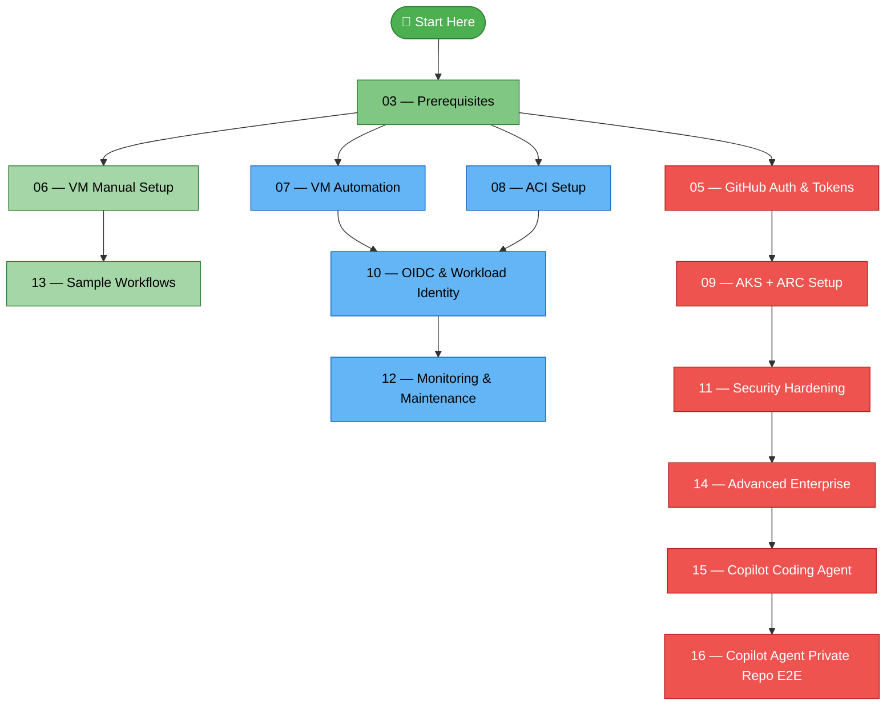

# Self-Hosted Runners on Azure — Tutorial Guide

> A comprehensive, step-by-step guide to deploying and managing GitHub Actions self-hosted runners on Azure — from your first VM to enterprise-scale Kubernetes clusters.

---

## 🗺️ Learning Path

**Legend:** 🟢 Beginner &nbsp;|&nbsp; 🔵 Intermediate &nbsp;|&nbsp; 🔴 Advanced

---

## 📑 Full Table of Contents

| # | Guide | Level | Description |
|---|-------|-------|-------------|
| 01 | [Introduction](01-introduction.md) | 🟢 Beginner | What are self-hosted runners, why use them, architecture overview |
| 02 | [Decision Guide](02-decision-guide.md) | 🟢 All | VM vs ACI vs AKS — choose the right platform |
| 03 | [Prerequisites](03-prerequisites.md) | 🟢 All | Azure account, GitHub Enterprise Cloud, CLI tools |
| 04 | [Networking & Connectivity](04-networking-connectivity.md) | 🟡 Intermediate | Required endpoints, NSG, proxy, firewall configuration |
| 05 | [GitHub Auth & Tokens](05-github-auth-tokens.md) | 🟡 Intermediate | Registration tokens, GitHub App, PAT, JIT runners |
| 06 | [VM Manual Setup](06-vm-manual-setup.md) | 🟢 Beginner | Create Azure VM and install runner step-by-step |
| 07 | [VM Automation](07-vm-automation.md) | 🟡 Intermediate | cloud-init and Bicep templates for automated VM setup |
| 08 | [ACI Setup](08-aci-setup.md) | 🟡 Intermediate | Container-based runners on Azure Container Instances |
| 09 | [AKS + ARC Setup](09-aks-arc-setup.md) | 🔴 Advanced | Kubernetes runners with Actions Runner Controller |
| 10 | [OIDC & Workload Identity](10-oidc-workload-identity.md) | 🟡 Intermediate | Passwordless Azure authentication with federated credentials |
| 11 | [Security Hardening](11-security-hardening.md) | 🔴 Advanced | OS hardening, network security, secrets management, compliance |
| 12 | [Monitoring & Maintenance](12-monitoring-maintenance.md) | 🟡 Intermediate | Health monitoring, logging, updates, troubleshooting |
| 13 | [Sample Workflows](13-sample-workflows.md) | 🟢 All | 6 ready-to-use GitHub Actions workflow examples |
| 14 | [Advanced Enterprise](14-advanced-enterprise.md) | 🔴 Advanced | Runner groups, cost optimization, multi-region, compliance |
| 15 | [Copilot Coding Agent on Self-Hosted](15-copilot-coding-agent.md) | 🔴 Advanced | Field notes for running GitHub Copilot Coding Agent on self-hosted runners (the four requirements + troubleshooting) |
| 16 | [Copilot Agent — Private Repo E2E](16-copilot-agent-arc-end-to-end.md) | 🔴 Advanced | End-to-end worked example: run Copilot Coding Agent on a **private** repo via AKS + ARC + GitHub App |
| 17 | [Agent Skills](17-agent-skills.md) | 🟡 Intermediate | The **13 GitHub Copilot Agent Skills** that operate the fleet conversationally — provision, triage, migrate, audit, health, cost, usage-map |

---

## 🤖 Operate the fleet with Agent Skills

Beyond the manual guides, this repo bundles **13 [GitHub Copilot Agent Skills](17-agent-skills.md)**
under [`.github/skills/`](../.github/skills/) that let an agent **do and verify**
fleet operations — from provisioning and triage to security audits, health,
cost reports, and a cross-repo runner-usage census. See
**[17 — Agent Skills](17-agent-skills.md)** for the full catalog and how to
invoke them.

---

## 🔍 "I Want To…" Quick Reference

| I want to… | Go to |
|-------------|-------|
| Understand what self-hosted runners are | [01 — Introduction](01-introduction.md) |
| Choose between VM, ACI, and AKS | [02 — Decision Guide](02-decision-guide.md) |
| Set up my first runner on a VM | [06 — VM Manual Setup](06-vm-manual-setup.md) |
| Automate runner provisioning | [07 — VM Automation](07-vm-automation.md) |
| Run ephemeral runners in containers | [08 — ACI Setup](08-aci-setup.md) |
| Scale runners with Kubernetes | [09 — AKS + ARC Setup](09-aks-arc-setup.md) |
| Authenticate to Azure without secrets | [10 — OIDC & Workload Identity](10-oidc-workload-identity.md) |
| Harden my runners for production | [11 — Security Hardening](11-security-hardening.md) |
| Monitor and troubleshoot runners | [12 — Monitoring & Maintenance](12-monitoring-maintenance.md) |
| See example workflows | [13 — Sample Workflows](13-sample-workflows.md) |
| Manage runner groups for my enterprise | [14 — Advanced Enterprise](14-advanced-enterprise.md) |
| Run GitHub Copilot Coding Agent on a self-hosted runner | [15 — Copilot Coding Agent on Self-Hosted](15-copilot-coding-agent.md) |
| Run Copilot Coding Agent on my **private** repo, end-to-end | [16 — Copilot Agent Private Repo E2E](16-copilot-agent-arc-end-to-end.md) |
| Provision & verify a runner conversationally | [`ghrunner-provision`](../.github/skills/ghrunner-provision/SKILL.md) · [17](17-agent-skills.md) |
| Diagnose why a runner job failed | [`ghrunner-triage`](../.github/skills/ghrunner-triage/SKILL.md) · [17](17-agent-skills.md) |
| Migrate a repo's workflows to self-hosted | [`runner-workflow-onboard`](../.github/skills/runner-workflow-onboard/SKILL.md) · [17](17-agent-skills.md) |
| Audit the fleet's security posture | [`runner-hardening-audit`](../.github/skills/runner-hardening-audit/SKILL.md) · [17](17-agent-skills.md) |
| Check fleet health & capacity | [`runner-fleet-health`](../.github/skills/runner-fleet-health/SKILL.md) · [17](17-agent-skills.md) |
| Analyze fleet cost & right-sizing | [`runner-cost-optimizer`](../.github/skills/runner-cost-optimizer/SKILL.md) · [17](17-agent-skills.md) |
| Map which repos use which runners | [`runner-usage-map`](../.github/skills/runner-usage-map/SKILL.md) · [17](17-agent-skills.md) |

---

## 🖥️ Platform Compatibility Matrix

| Feature | Azure VM | ACI | AKS + ARC |
|---------|:--------:|:---:|:---------:|
| Docker builds | ✅ | ❌ | ✅ (DinD) |
| Service containers | ✅ | ❌ | ✅ |
| Persistent caching | ✅ | ❌ | ✅ (PVC) |
| Auto-scaling | Manual | Limited | ✅ Native |
| Ephemeral runners | Via script | ✅ | ✅ |
| Custom tools | ✅ | Image only | Image only |
| GPU workloads | ✅ | ✅ | ✅ |
| Private networking | ✅ VNet | ✅ VNet | ✅ VNet |

---

## 📁 Supporting Files

| Directory | Contents |
|-----------|----------|
| `bicep/` | Infrastructure as Code templates |
| `scripts/` | Automation scripts |
| `containers/` | Runner container image |
| `k8s/` | Kubernetes manifests |
| `.github/workflows/` | Sample workflows |
| `.github/skills/` | [13 Agent Skills](../.github/skills/README.md) that operate the fleet (see [17](17-agent-skills.md)) |

---

> **Navigation note:** Each guide includes **⬅️ Previous** / **Next ➡️** navigation links at the bottom for easy sequential reading.
